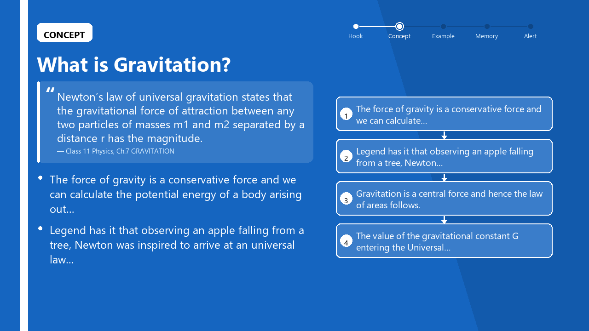
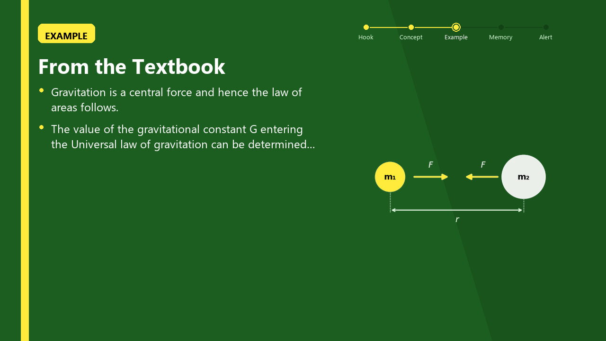
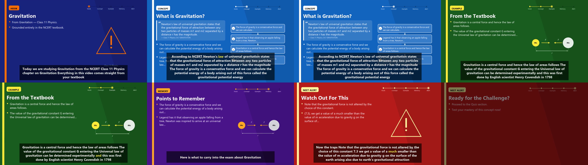

# TEXTBOOK-GROUNDED AI ASSISTANT WITH VIDEO GENERATION FOR NEET

## Capstone Project Report
### MID SEMESTER EVALUATION

**Submitted by:**

(102303093) UJJWAL DALAL
(102303412) PURNIKA MALHOTRA
(102313055) PALLIKA MALHOTRA
(102316042) UJJWAL THAPA
(102316044) SHUBHAM

BE Third Year, CoE/CoSE

**CPG No: 92**

Under the Mentorship of

**Dr. Chinmaya Panigrahy**
Assistant Professor - III

Computer Science and Engineering Department
Thapar Institute of Engineering and Technology, Patiala

**August 2026**

---

# ABSTRACT

School students increasingly prefer to learn from short instructional videos, but the AI tools
available to them are not built for classroom learning. They generate answers from open-web
knowledge rather than from the prescribed textbook, they cannot verify whether a student has
understood a lesson, and they require a teacher or developer to prepare a script before any video
can be produced. The result is content that is often unaligned with the syllabus, occasionally
incorrect, and impossible to personalise at scale.

This project implements an end-to-end system that converts a student's topic query into a narrated
instructional video whose every factual claim is drawn from the NCERT textbook corpus, followed
by an adaptive assessment that updates a per-student mastery model. The system is targeted at NEET
aspirants studying Physics, Chemistry and Biology at the Class 11 and 12 level.

The implemented pipeline has five stages. A custom ingestion engine parses NCERT chapter PDFs into
markdown, splits them into retrieval units with table rows separated from prose, embeds them with a
sentence-transformer model and stores them in a Qdrant vector database with class, subject and
chapter metadata; 2,876 chunks across 60 chapters are currently indexed. A metadata-filtered
retrieval engine constrains search to the correct book and performs a second, sentence-level
re-ranking pass inside the retrieved chunks, which raised top-1 correct-book accuracy from 62% to
100% on an eight-query NEET-style benchmark. A scene builder assembles a five-part lesson
storyboard — Hook, Concept, Example, Memory and NEET Alert — from the retrieved passages, with the
on-screen definition carrying its chapter citation. A text-to-speech pipeline normalises
subject-specific notation before synthesis, produces word-level timestamps and normalises loudness
to a common target. A video assembly engine renders themed slides pixel-by-pixel with PIL, draws
topic-matched concept diagrams, burns in karaoke-style subtitles aligned to the speech timestamps,
and encodes a 1280x720 H.264 MP4. A FastAPI backend with WebSocket progress reporting, MongoDB
persistence and a React front end exposes the pipeline to students, and an Item Response Theory
model updates each student's ability estimate from quiz responses.

Measured results at mid-semester: retrieval top-1 accuracy of 8/8 on the benchmark after filtering,
end-to-end video generation reduced from 585 s to 125 s (4.7x) through a frame-compositing
optimisation identified by profiling, and a working prototype that produces a complete narrated
video with cited textbook definitions for any topic present in the indexed corpus.

---

# DECLARATION

We hereby declare that the design principles and working prototype model of the project entitled
**Textbook-Grounded AI Assistant with Video Generation for NEET** is an authentic record of our own
work carried out in the Computer Science and Engineering Department, TIET, Patiala, under the
guidance of **Dr. Chinmaya Panigrahy** during 6th semester (2026).

Date: ______________

| Roll No. | Name | Signature |
| --- | --- | --- |
| 102303093 | Ujjwal Dalal | ---- |
| 102303412 | Purnika Malhotra | ---- |
| 102313055 | Pallika Malhotra | ---- |
| 102316042 | Ujjwal Thapa | ---- |
| 102316044 | Shubham | ---- |

*Counter Signed By:*

**Faculty Mentor:**

Dr. Chinmaya Panigrahy
Assistant Professor - III
CSED, TIET, Patiala

---

# ACKNOWLEDGEMENT

We would like to express our thanks to our mentor Dr. Chinmaya Panigrahy. He has been of great help
in our venture and an indispensable resource of technical knowledge. He is truly an amazing mentor
to have.

We are also thankful to the Head, Computer Science and Engineering Department, the entire faculty
and staff of the Computer Science and Engineering Department, and also our friends who devoted
their valuable time and helped us in all possible ways towards successful completion of this
project. We thank all those who have contributed either directly or indirectly towards this project.

Lastly, we would also like to thank our families for their unyielding love and encouragement. They
always wanted the best for us and we admire their determination and sacrifice.

Date: ______________

| Roll No. | Name | Signature |
| --- | --- | --- |
| 102303093 | Ujjwal Dalal | ---- |
| 102303412 | Purnika Malhotra | ---- |
| 102313055 | Pallika Malhotra | ---- |
| 102316042 | Ujjwal Thapa | ---- |
| 102316044 | Shubham | ---- |

---

# TABLE OF CONTENTS

| | Page No. |
| --- | --- |
| ABSTRACT | ii |
| DECLARATION | iii |
| ACKNOWLEDGEMENT | iv |
| LIST OF FIGURES | v |
| LIST OF TABLES | vi |
| LIST OF ABBREVIATIONS | vii |
| **1. Introduction** | 1 |
| 1.1 Project Overview | 1 |
| 1.2 Need Analysis | 5 |
| 1.3 Research Gaps | 6 |
| 1.4 Problem Definition and Scope | 8 |
| 1.5 Assumptions and Constraints | 10 |
| 1.6 Standards | 11 |
| 1.7 Approved Objectives | 12 |
| 1.8 Methodology | 13 |
| 1.9 Project Outcomes and Deliverables | 15 |
| 1.10 Novelty of Work | 16 |
| **2. Requirement Analysis** | 18 |
| 2.1 Literature Survey | 18 |
| 2.2 Software Requirement Specification | 24 |
| 2.3 Cost Analysis | 31 |
| 2.4 Risk Analysis | 32 |
| **3. Methodology Adopted** | 34 |
| 3.1 Investigative Techniques | 34 |
| 3.2 Proposed Solution | 37 |
| 3.3 Work Breakdown Structure | 41 |
| 3.4 Tools and Technology | 44 |
| **4. Design Specifications** | 46 |
| 4.1 System Architecture | 46 |
| 4.2 Design Level Diagrams | 49 |
| 4.3 User Interface Diagrams | 54 |
| 4.4 Snapshots of Working Prototype | 56 |
| **5. Conclusions and Future Scope** | 62 |
| 5.1 Work Accomplished | 62 |
| 5.2 Conclusions | 65 |
| 5.3 Environmental, Economic and Social Benefits | 66 |
| 5.4 Future Work Plan | 67 |
| APPENDIX A: References | 69 |
| APPENDIX B: Plagiarism Report | 71 |

---

# LIST OF FIGURES

| Figure No. | Caption | Page No. |
| --- | --- | --- |
| Figure 1 | Five-phase processing pipeline of the proposed system | 2 |
| Figure 2 | Work breakdown structure by module and owner | 41 |
| Figure 3 | Three-tier system architecture | 46 |
| Figure 4 | Data flow of the NCERT ingestion and indexing engine | 49 |
| Figure 5 | Two-stage retrieval with sentence-window re-ranking | 50 |
| Figure 6 | Video assembly pipeline from scene JSON to MP4 | 52 |
| Figure 7 | Front-end navigation flow | 54 |
| Figure 8 | Slide layout template with title-safe area | 55 |
| Figure 9 | Prototype snapshot: CONCEPT slide with cited definition | 57 |
| Figure 10 | Prototype snapshot: EXAMPLE slide with generated concept diagram | 58 |
| Figure 11 | Prototype snapshot: complete video timeline, all five scenes | 59 |
| Figure 12 | Frame-generation cost by pipeline stage | 60 |

---

# LIST OF TABLES

| Table No. | Caption | Page No. |
| --- | --- | --- |
| Table 1 | Technology stack: components built versus libraries used | 3 |
| Table 2 | Assumptions | 10 |
| Table 3 | Constraints | 10 |
| Table 4 | Approved objectives and their mapping to implemented modules | 12 |
| Table 5 | Literature survey, distributed by team member | 21 |
| Table 6 | Functional requirements | 26 |
| Table 7 | API endpoints exposed by the backend | 28 |
| Table 8 | MongoDB collections and indexes | 29 |
| Table 9 | Non-functional requirements and measured status | 30 |
| Table 10 | Cost analysis | 31 |
| Table 11 | Risk analysis | 32 |
| Table 12 | Investigative techniques considered | 35 |
| Table 13 | Module ownership and deliverable status | 42 |
| Table 14 | Tools and technologies used | 44 |
| Table 15 | Scene JSON contract between the LLM and video stages | 51 |
| Table 16 | Corpus composition of the indexed NCERT collection | 56 |
| Table 17 | Retrieval accuracy before and after metadata filtering | 57 |
| Table 18 | Subject-specific text normalisation examples | 58 |
| Table 19 | TTS engine comparison | 59 |
| Table 20 | Output video specifications | 59 |
| Table 21 | Frame pipeline profile: cost per rendering feature | 60 |
| Table 22 | End-to-end generation time before and after optimisation | 61 |
| Table 23 | Objective-wise work accomplished | 62 |

---

# LIST OF ABBREVIATIONS

| | |
| --- | --- |
| AAC | Advanced Audio Coding |
| API | Application Programming Interface |
| ASR | Automatic Speech Recognition |
| BM25 | Best Matching 25 (sparse ranking function) |
| CRUD | Create, Read, Update, Delete |
| DPI | Dots Per Inch |
| FPS | Frames Per Second |
| HTTP | HyperText Transfer Protocol |
| IRT | Item Response Theory |
| JWT | JSON Web Token |
| LLM | Large Language Model |
| LUFS | Loudness Units relative to Full Scale |
| MOS | Mean Opinion Score |
| MRR | Mean Reciprocal Rank |
| NCERT | National Council of Educational Research and Training |
| NEET | National Eligibility cum Entrance Test |
| OCR | Optical Character Recognition |
| PIL | Python Imaging Library |
| PPA | Persona-Purpose-Action (prompt framework) |
| RAG | Retrieval-Augmented Generation |
| REST | Representational State Transfer |
| RTF | Real-Time Factor |
| SRS | Software Requirement Specification |
| TTL | Time To Live |
| TTS | Text-To-Speech |
| WBS | Work Breakdown Structure |

---

# CHAPTER 1: INTRODUCTION

## 1.1 Project Overview

### 1.1.1 What the system does

This project implements a system that takes a single topic query from a school student — for
example, "Gravitation" — and returns a narrated instructional video in which every factual claim is
taken from the student's own NCERT textbook, followed by an assessment that adapts to how the
student performs.

The student does not upload anything, does not write a script, and does not select a template. The
entire path from query to video is automatic: the system decides which textbook chapter the topic
belongs to, extracts the passages that define and explain it, arranges them into a five-part lesson,
speaks the lesson aloud in an Indian-English voice, renders a themed slide for each part with a
matching diagram, aligns subtitles to the spoken words, and encodes the result as an MP4. A
progress bar driven by a WebSocket connection reports each stage while this happens.

The target audience is NEET aspirants studying Physics, Chemistry and Biology in Classes 11 and 12.
This scope was chosen deliberately. NEET is an examination in which the prescribed NCERT text is not
merely a recommended reference but effectively the syllabus itself; a large fraction of questions
are answerable directly from NCERT wording. A system whose defining property is that it never
departs from the textbook is therefore of maximum value in exactly this setting.

### 1.1.2 Why textbook grounding is the central design decision

A general-purpose AI assistant answers from the knowledge encoded in its parameters. That knowledge
is broad but unattributable: the assistant cannot say which page its answer came from, and it cannot
guarantee that the answer matches the syllabus the student is being examined on. For a student who
is being marked against a specific textbook, a plausible-sounding answer that goes beyond or
contradicts that textbook is worse than no answer at all, because the student has no way to detect
the discrepancy.

Retrieval-Augmented Generation (RAG) addresses this by constraining the generator to a supplied
document context [1]. The present system takes that constraint further than a typical RAG chatbot:
the on-screen definition in the CONCEPT scene is not a paraphrase but the retrieved sentence itself,
displayed with its chapter citation beneath it. A student watching the video can therefore open the
named chapter and find the same sentence. This is the property from which the project's title —
*textbook-grounded* — is drawn, and it is enforced structurally rather than by instruction.

### 1.1.3 Structure of the pipeline

The system is organised as five sequential phases, shown in Figure 1.

```
  PHASE 1            PHASE 2           PHASE 3          PHASE 4          PHASE 5
┌───────────┐     ┌───────────┐     ┌───────────┐    ┌───────────┐    ┌───────────┐
│  NCERT    │     │ Retrieval │     │  Script   │    │   TTS +   │    │ Adaptive  │
│ Ingestion │ ──▶ │  Engine   │ ──▶ │   Scene   │──▶ │   Video   │──▶ │   Quiz    │
│ & Indexing│     │ (filtered │     │ Assembly  │    │ Assembly  │    │& Analytics│
│           │     │  + rerank)│     │           │    │           │    │           │
└───────────┘     └───────────┘     └───────────┘    └───────────┘    └───────────┘
   PDF →            query →           passages →        scenes →         answers →
   chunks           passages          storyboard        MP4              mastery
```

**FIGURE 1: Five-phase processing pipeline of the proposed system**

**Phase 1 — Ingestion and indexing.** NCERT chapter PDFs are converted to markdown with a
layout-aware extractor, with an OCR fallback for pages whose text layer is poor. The markdown is
split at section headers and then into retrieval units, with markdown tables decomposed so that each
data row becomes its own unit rather than being buried inside a large text block. Each unit is
embedded with a sentence-transformer model and written to a Qdrant vector collection together with
metadata identifying its class, subject, chapter number, chapter name and content type.

**Phase 2 — Retrieval.** A student query is embedded and searched against the collection under
filters that restrict results to the correct class and subject and to prose rather than table rows.
Because the ingested chunks are large, a second pass splits the retrieved chunks into sentences,
re-embeds them, and re-ranks them against the query, so the precise defining sentence is recovered
from inside a multi-page section.

**Phase 3 — Script and scene assembly.** The retrieved passages are arranged into a five-part
pedagogical structure — Hook, Concept, Example, Memory, NEET Alert — and emitted as a scene JSON
array. Each scene carries its narration text, slide title, bullet points, a visual specification and
an animation type. A prompt architecture built on the Persona-Purpose-Action framework, together
with subject-specific addenda and a three-version prompt repository, has been implemented for the
language-model path that will replace the current retrieval-only assembler.

**Phase 4 — Speech and video.** The narration for each scene is normalised for speech — units,
Greek letters, chemical formulae and mathematical operators are expanded into spoken form — and
synthesised with a neural Indian-English voice that returns word-level timestamps. The audio is
high-pass filtered, silence-trimmed and loudness-normalised, and the timestamps are corrected by the
amount of leading silence removed. Each scene's slide is rendered pixel-by-pixel with PIL, a
topic-matched concept diagram is drawn, an animation is applied, and karaoke subtitles are burned in
using the corrected timestamps. The scenes are concatenated with an intro and outro card and encoded
to H.264/AAC MP4.

**Phase 5 — Assessment.** After the video, multiple-choice questions are presented. Each response
updates the student's ability estimate under a one-parameter Item Response Theory model and updates
a per-topic mastery score, from which weak topics and a recommended next topic are derived.

### 1.1.4 What is built rather than called

A distinguishing characteristic of this project is that the components which determine output
quality are implemented rather than consumed as services. Table 1 separates the two.

| Layer | Built from scratch in this project | Libraries used |
| --- | --- | --- |
| PDF ingestion | Layout-aware parser, OCR fallback policy, table-row decomposition, metadata derivation from directory structure, syllabus-scope filtering | PyMuPDF, pymupdf4llm, PaddleOCR |
| Vector indexing | Embedding pipeline, payload schema, payload index management, de-duplicated re-ingestion | sentence-transformers, Qdrant |
| Retrieval | Metadata filter composition, two-stage chapter selection, sentence-window re-ranking, definition detection with quality gate, context assembly with citations | Qdrant client |
| Prompt architecture | PPA framework, five prompt templates, three subject addenda, prompt versioning and comparison, hallucination detector, ablation harness | — |
| TTS pipeline | Subject-aware text normaliser, prosody injection, loudness normalisation, silence trimming, word-timestamp correction | edge-tts, pydub |
| Video assembly | Slide renderer, pixel-accurate text layout, glyph-coverage font resolution, concept diagram library, animation dispatcher, karaoke subtitle compositor, assembly orchestrator | PIL, matplotlib, MoviePy, FFmpeg |
| Quiz engine | 1PL IRT ability update, mastery tracking, weak-topic selection | — |
| Web platform | REST API, async job queue, WebSocket progress broadcast, JWT authentication, React client | FastAPI, MongoDB, React |

**TABLE 1: Technology stack: components built versus libraries used**

The distinction matters for a capstone assessment. Calling a video-generation API is a single
function call; deciding what the video should contain, proving that the content came from the
textbook, laying out a readable slide, keeping subtitles synchronised with speech after audio
processing has shifted the timeline, and making the whole thing render in a usable amount of time
are the engineering problems this project actually solves.

### 1.1.5 Current state of the prototype

At mid-semester the pipeline runs end to end. A corpus of 2,876 retrieval units spanning
approximately 60 NCERT chapters is indexed. A topic query produces a five-scene video of
approximately 75-85 seconds with a cited definition on screen and synchronised karaoke subtitles.
The backend exposes the pipeline over REST and WebSocket, and a React client covering seven pages
has been developed. The two components not yet exercised end to end are the language-model script
generation stage, which is implemented against a mock provider pending an API key, and the
extraction of original NCERT figures, which requires the source PDF collection to be added to the
repository. Both are addressed in Section 5.4.

## 1.2 Need Analysis

The need for this system arises from the convergence of four separate deficiencies in the tools
currently available to school students, each of which is individually documented in the literature.

**Content that is not answerable to a syllabus.** Generative assistants answer from parametric
knowledge. Where a student is examined against a specific prescribed text, an answer that is correct
in general but phrased differently, scoped more broadly, or drawn from a different curriculum is not
usable, and the student cannot detect the mismatch. Retrieval grounding has been shown to
substantially improve factual accuracy over unconstrained generation [1], and self-reflective
retrieval further reduces hallucination [3], but these systems produce text and were not designed
for curriculum alignment.

**A delivery format students do not prefer.** Learners increasingly favour short, visual
instruction. Controlled studies show that AI-generated instructional video produces learning
outcomes statistically indistinguishable from video recorded by a human instructor, across 76
students [4] and independently across 83 adult learners [5]. This decouples instructional quality
from teacher availability — but both studies required a human to prepare the script or slides
beforehand, which is precisely the bottleneck that prevents such systems from responding to a
student's question on demand.

**No verification that learning occurred.** Most content-generation systems terminate at delivery.
They do not ask whether the student understood, and therefore cannot adapt. Retrieval-grounded
question generation has been shown to produce higher-quality questions from school textbooks than
generation without retrieval [6], and to improve the usefulness of hints given to students who
answer incorrectly [7], yet neither system delivers content as video or adjusts subsequent
instruction.

**Fragmentation across the required capabilities.** Multimodal retrieval systems [8][9][10][11][12]
have advanced substantially, but each addresses retrieval or reasoning as an end in itself rather
than as a stage in a teaching pipeline. The individual capabilities needed for a grounded, video-
delivered, adaptive tutor exist in the literature; they have not been assembled into a single
student-facing system.

The significance of this work is therefore integrative as much as technical. It demonstrates that a
retrieval-grounded pipeline can carry a claim from a textbook page, through a spoken narration and a
rendered slide, to a student's screen with the citation intact — and that this can be done in
approximately two minutes on commodity hardware, with no human in the loop.

## 1.3 Research Gaps

Five gaps were identified from the literature reviewed in Chapter 2, each of which this project
addresses directly.

**Gap 1 — Retrieval-augmented generation has not been applied to curriculum-bound delivery.**
The foundational RAG work [1] and the subsequent survey [2] establish that grounding a generator in
retrieved documents improves factual accuracy, and Self-RAG [3] adds learned control over when to
retrieve and self-critique of the output. All three, however, evaluate on open-domain question
answering and produce free text. None constrains its corpus to a single prescribed curriculum, and
none carries source attribution through to the artefact the end user consumes. The specific problem
of ensuring that a school student sees the sentence from their own textbook, attributed to its
chapter, is not addressed. This project closes the gap by treating the retrieved sentence as the
displayed artefact rather than as hidden context, and by rendering its citation on the slide.

**Gap 2 — Automated instructional video generation still requires human-authored input.**
Both controlled studies establishing the educational equivalence of AI-generated video [4][5] begin
from a manually prepared script or slide deck. The generation is automated; the *authoring* is not.
Consequently these systems cannot answer a query that was not anticipated, which rules out the
on-demand, per-student use case entirely. This project removes the authoring step: the storyboard is
assembled from retrieved passages at request time, so any topic present in the indexed corpus can be
turned into a video without prior preparation.

**Gap 3 — Multimodal retrieval systems retrieve but do not teach.**
BLIP-2 [8] and Video-LLaMA [9] enable vision- and audio-language reasoning; VideoRAG [10], Video-RAG
[11] and Multi-RAG [12] retrieve across text, audio and video corpora. Each of these produces an
answer or a retrieved segment. None imposes pedagogical structure on its output — there is no notion
of a hook, a worked example, a mnemonic or an examination-specific warning, and no notion of pacing a
lesson. This project imposes a five-part instructional structure on the retrieved material, so the
output is a lesson rather than an answer.

**Gap 4 — Assessment is decoupled from the content that was actually delivered.**
Retrieval-augmented question generation [6] and retrieval-augmented mathematics tutoring [7] both
demonstrate that grounding improves question quality, but they treat question generation as a
standalone task. In neither case do the questions derive from the specific passage a student was
just shown, and in neither case does the student's performance feed back into what is delivered
next. This project generates assessment from the same retrieved context that produced the video and
routes the response into an ability model that selects the next topic.

**Gap 5 — End-to-end latency is not treated as a research variable.**
The video-generation literature reports learning outcomes but not generation time [4][5], and the
retrieval literature reports accuracy but not the cost of assembling a multimodal artefact
[10][11][12]. For a system intended to answer a student's question while they are studying, latency
is a functional requirement, not an implementation detail: a lesson that arrives ten minutes later
has lost its occasion. This project treats generation latency as a measured quantity, profiles the
pipeline to locate its cost, and reports a 4.7x reduction obtained by replacing a
general-purpose compositing path with a purpose-built one (Section 4.4).

## 1.4 Problem Definition and Scope

### 1.4.1 Problem definition

Given a topic query *q* from a student, a class level *c* and a subject *s*, construct an
instructional artefact *V* such that:

1. every factual assertion in *V* is traceable to a passage in the NCERT corpus for (*c*, *s*);
2. *V* is delivered as narrated video with synchronised visual and textual reinforcement;
3. *V* is structured pedagogically rather than presented as a flat answer;
4. an assessment *A* derived from the same source passages measures whether the student
   understood *V*, and the response updates a persistent model of that student's ability;
5. the construction of *V* requires no human authoring and completes within an interactive
   time budget.

### 1.4.2 In scope

- NCERT textbooks for Physics, Chemistry and Biology, Classes 11 and 12.
- English-language content and English-language narration in an Indian accent.
- Topic-level queries — a chapter, a concept or a named law — rather than arbitrary
  free-form conversational questions.
- Slide-based instructional video with narration, concept diagrams and karaoke subtitles.
- Multiple-choice assessment with a one-parameter ability model.
- A web client for query submission, video playback, quiz attempt and progress review.

### 1.4.3 Out of scope

- Languages other than English, in both corpus and narration.
- Photorealistic or lip-synchronised avatar presenters. The project proposal listed
  avatar-based video among the deliverables; the implementation guide that governs this
  report specifies slide-based assembly with MoviePy and PIL, and the implemented system
  follows the latter. The rationale is recorded in Section 5.1.
- Subjects outside Physics, Chemistry and Biology, and classes outside 11 and 12. Class 9
  and 10 Science material present in the source dataset is explicitly excluded from
  retrieval (Section 4.4).
- Handwriting recognition, diagram-based queries, or ingestion of student-supplied notes.
- Live classroom features such as doubt sessions, chat or peer interaction.

## 1.5 Assumptions and Constraints

| S. No. | Assumption |
| --- | --- |
| 1 | The NCERT chapter PDFs supplied to the ingestion engine are digitally generated documents with a recoverable text layer. Where the text layer is degraded, the ingestion engine detects low extraction yield and falls back to OCR; a scanned-only corpus would rely entirely on this path and would extract more slowly and less accurately. |
| 2 | The source PDF collection is organised in a directory structure of the form `Class <n> <Subject> [part <k>]/<chapter number>. <Chapter Name>.pdf`, from which class, subject, part, chapter number and chapter name metadata are derived. Files that do not follow this convention will be indexed with incomplete metadata and will not be reachable by filtered retrieval. |
| 3 | The student has a browser and a working internet connection. Speech synthesis and vector search are both network services, so the system is not usable offline in its present form. |
| 4 | A topic queried by the student exists in the indexed corpus. When retrieval finds no matching chapter the system falls back to a hand-written storyboard so that a video is still produced, but such a video is not textbook-grounded and is labelled as such internally. |
| 5 | Students are assumed to attempt the assessment honestly and without external assistance, since the ability estimate produced by the IRT model is only meaningful under that assumption. |
| 6 | Generated videos are consumed on a display of at least 1280x720, which is the render resolution. Playback on smaller displays will scale but subtitle legibility has not been evaluated below this resolution. |

**TABLE 2: Assumptions**

| S. No. | Constraint |
| --- | --- |
| 1 | Speech synthesis depends on an external neural TTS service; no offline voice of comparable quality with word-level timestamps is currently configured. |
| 2 | Video encoding is CPU-bound. On the development machine, encoding accounts for approximately 90% of generation time and scales linearly with video duration. |
| 3 | The vector database is a hosted free-tier cluster shared by the team, which bounds corpus size and query throughput. |
| 4 | The language-model stage requires a paid API key which has not yet been provisioned; the prompt architecture is therefore exercised against a mock provider. |
| 5 | Copyright in the NCERT text and figures rests with NCERT. The system reproduces short passages with attribution for educational use and does not redistribute the source PDFs. |
| 6 | Development is on Windows; the code is written to be portable, and font and path handling in particular were made platform-independent (Section 4.4), but deployment on Linux has not yet been validated. |

**TABLE 3: Constraints**

## 1.6 Standards

The following standards and conventions are observed in the implementation.

**Media and encoding.** Video is encoded as H.264 (ITU-T H.264 / MPEG-4 Part 10) in an MP4
container, at 1280x720 with progressive scan and 4:2:0 chroma subsampling, at 24 frames per second.
Audio is AAC-LC at 44.1 kHz stereo. Narration loudness is normalised toward −16 LUFS, the accepted
target for spoken-word programme material; where the true ITU-R BS.1770 integrated loudness meter is
unavailable the module falls back to an RMS dBFS approximation and records which metric was used, so
that no measurement is reported with more precision than it possesses.

**Web and API.** The backend exposes a REST interface over HTTP/1.1 with JSON payloads, documented
automatically through the OpenAPI 3 schema generated by FastAPI. Real-time progress uses the
WebSocket protocol (RFC 6455). Authentication uses JSON Web Tokens (RFC 7519) signed with HS256, and
passwords are stored as bcrypt hashes.

**Text and typography.** All text handling is Unicode (UTF-8). Slide rendering selects a typeface by
verified glyph coverage of the scientific character set required by the corpus — subscripts,
superscripts, Greek letters and mathematical operators — rather than by name, so that characters such
as m₁ and kg⁻² are never rendered as missing-glyph boxes.

**Software engineering.** The project follows an Agile increment-based lifecycle with version
control in Git, one module per team member, and code review before merge to the integration branch.
Python code follows PEP 8. Dependencies are pinned in a requirements file, with the video library
pinned to a specific major version because its successor renames the public API.

**Accessibility.** Every video carries burned-in subtitles synchronised at word level, which serves
both accessibility and comprehension. Slide colour pairs are chosen for contrast against their
backgrounds, and label colours are selected automatically by luminance so that text on a coloured
chip remains readable.

## 1.7 Approved Objectives

The following four objectives were approved at proposal evaluation. Table 4 maps each to the modules
that implement it; Section 5.1 discusses the extent to which each has been met.

| No. | Approved objective | Implementing modules |
| --- | --- | --- |
| 1 | **Build a textbook-grounded RAG pipeline** — extract and chunk school textbook content, retrieve the most relevant passages for a given student query, and use them as the sole source for answer generation, ensuring curriculum-aligned and factually accurate responses. | `scripts/extract.py`, `app/rag/retriever.py`, `app/rag/scene_builder.py` |
| 2 | **Automate end-to-end educational video generation** — convert a retrieved textbook answer into a structured script, synthesise voice narration using TTS, and produce a short instructional video with synchronised audio and visual slides, requiring no manual input. | `app/tts/*`, `app/video/*`, `app/services/job_queue.py` |
| 3 | **Deliver a focused and functional student-facing interface** — a responsive web application through which students submit queries, watch the generated lesson, and track progress. | `app/api/routes/*`, `app/services/websocket_manager.py`, React client |
| 4 | **Optimise system performance and response time** — minimise end-to-end latency to enable near real-time generation. | `app/video/subtitle_engine.py`, `scripts/profile_frame_pipeline.py`, `scripts/benchmark_video.py` |

**TABLE 4: Approved objectives and their mapping to implemented modules**

## 1.8 Methodology

The project follows an Agile, increment-based methodology in which each phase produces an
independently demonstrable module. The five phases below correspond to those approved in the
proposal; the activity within each has been refined as implementation revealed the actual
difficulties.

**Phase 1 — Requirement analysis and system design.** Existing learning platforms were analysed for
the four deficiencies set out in Section 1.2. The technology stack was selected against explicit
criteria: a vector store with metadata filtering, a speech engine returning word-level timestamps, a
video library permitting frame-level control, and an asynchronous web framework with WebSocket
support. The five-phase architecture and the data contracts between phases were fixed at this stage,
in particular the scene JSON schema (Table 15), which is the interface between the content and media
halves of the system and which allowed the two halves to be developed in parallel.

**Phase 2 — Ingestion and retrieval.** The ingestion engine was built to convert chapter PDFs into
metadata-tagged retrieval units. The retrieval engine was then built on top of it and evaluated
against a benchmark of NEET-style queries, an evaluation that revealed the corpus-mixing and
chunk-size defects described in Section 4.4 and drove two rounds of correction.

**Phase 3 — Prompt architecture and scene assembly.** The PPA prompt framework, subject addenda,
scene segmentation and quiz generation templates were implemented with version control across three
template generations, together with a hallucination detector and an ablation harness that compares
prompt variants. In parallel, a retrieval-only scene assembler was built so that the media pipeline
could be developed and demonstrated before a language-model key was available.

**Phase 4 — Speech and video.** The TTS pipeline and the video assembly engine were developed
against the scene JSON contract. This phase produced the largest number of defects visible in the
output — text rendered as missing-glyph boxes, content clipped by the zoom animation, placeholder
graphics carrying no information — each of which was located by inspecting rendered frames rather
than by reading code, and each of which is documented with its fix in Section 4.4.

**Phase 5 — Integration, optimisation and evaluation.** The modules were integrated behind the
asynchronous job queue and the REST/WebSocket API. Performance was then measured rather than
assumed: profiling identified that a general-purpose compositing routine, not the video encoder,
dominated generation time, and replacing it reduced end-to-end generation by a factor of 4.7.

## 1.9 Project Outcomes and Deliverables

**Delivered at mid-semester:**

1. **An NCERT ingestion and indexing engine** that converts chapter PDFs into metadata-tagged
   retrieval units with OCR fallback, table-row decomposition, syllabus-scope filtering and
   idempotent re-ingestion. A corpus of 2,876 units across approximately 60 chapters is indexed.
2. **A metadata-filtered retrieval engine** with two-stage chapter selection, sentence-window
   re-ranking, definition detection with a quality gate, and citation-carrying context assembly,
   evaluated on an eight-query benchmark.
3. **A prompt architecture** comprising five templates across three versions, three subject
   addenda, a prompt manager with versioning, a hallucination detector, an ablation harness and
   a thirty-topic evaluation runner, with unit tests.
4. **A TTS pipeline** with subject-aware notation expansion, prosody injection, loudness
   normalisation, silence trimming and word-timestamp correction, plus an engine comparison
   harness and a blinded listening-test harness.
5. **A video assembly engine** producing 1280x720 H.264 video from scene JSON, with a themed
   slide renderer, a concept diagram library, an animation dispatcher, a karaoke subtitle
   compositor and intro/outro cards.
6. **A backend service** exposing generation, status, streaming progress, video retrieval, quiz
   submission, dashboard and authentication endpoints over REST and WebSocket, with MongoDB
   persistence and Cloudinary media storage.
7. **An adaptive quiz engine** implementing a one-parameter IRT ability update with per-topic
   mastery tracking and next-topic selection.
8. **A React front end** covering landing, search, generation progress, playback, quiz,
   dashboard and administration.
9. **A measurement suite** — retrieval evaluation, frame-pipeline profiler, video benchmark, TTS
   engine comparison and notation-expansion demonstrator — that regenerates every quantitative
   claim in this report.

**Remaining for end-semester:** language-model script generation against a live provider,
extraction of original NCERT figures, collection of Mean Opinion Score ratings, and the user study.
These are scheduled in Section 5.4.

## 1.10 Novelty of Work

The novelty of this project lies in four specific choices, each of which is a departure from what the
reviewed literature does.

**1. The retrieved sentence is the displayed artefact, not hidden context.** In a conventional RAG
system the retrieved passage is consumed by the generator and discarded; the user sees only the
generated text. Here the defining sentence retrieved from the textbook is rendered verbatim on the
CONCEPT slide inside a quotation card, with its chapter citation beneath it. Grounding therefore
becomes visible and checkable by the student, rather than being a property claimed by the system
about itself.

**2. Sentence-window re-ranking recovers precision from a coarse index without re-ingestion.** The
ingested chunks average 4,797 characters, which makes a chunk embedding an average over an entire
section. Measurement showed the consequence concretely: the statement of the universal law of
gravitation sits at character 2,951 of its chunk, and a query quoting the law almost verbatim failed
to retrieve that chunk in its top three. Rather than re-ingesting the corpus, the retriever fetches
whole chunks and then splits, re-embeds and re-ranks their sentences against the same query,
recovering the precise passage. This is a practical contribution: it decouples retrieval precision
from the chunk size chosen at ingestion time.

**3. Two-stage chapter-scoped definition search handles the lexical-mismatch case.** A defining
sentence frequently does not contain the term it defines — "Every body in the universe attracts every
other body…" never contains the word *gravitation* — so it loses on embedding similarity to weaker
sentences that repeat the query term. Unscoped search for "Gravitation" returned a sentence from the
chapter on Laws of Motion. The retriever therefore first selects the chapter by score-weighted vote,
then searches only within it, and rewards definitional phrasing while enforcing a quality gate that
returns nothing rather than a section heading. Measured effect: top-1 correct-book accuracy rose from
62% to 100% on the benchmark.

**4. Rendering cost is treated as a measured engineering variable.** Generation time was profiled
rather than estimated. The profile showed that the video encoder was not the bottleneck — changing
the encoder preset had no measurable effect — and that a general-purpose alpha-compositing routine
consumed over 90% of frame-generation time while operating on the bottom eighth of the frame.
Replacing it with a purpose-built float32 band compositor reduced full generation from 585 s to
125 s. The profiling harness is retained as a deliverable so the measurement is reproducible.

Taken together, these produce a system that does something none of the reviewed works does: it
carries a claim from a textbook page, with its citation intact, through retrieval, narration and
rendering, into a video a student watches — and does so in approximately two minutes on a laptop,
with no human authoring step.

---

# CHAPTER 2: REQUIREMENT ANALYSIS

## 2.1 Literature Survey

### 2.1.1 Theory Associated With Problem Area

Four bodies of theory underpin this project.

**Retrieval-augmented generation.** A language model generates from a distribution learned during
training. That distribution encodes a great deal, but it cannot be audited and cannot be updated for
a particular curriculum. Retrieval-augmented generation restructures the problem: a retriever selects
passages from an external corpus, and the generator is conditioned on those passages [1]. The
theoretical benefit is that the factual content of the output becomes a property of the corpus rather
than of the model weights, which makes it inspectable and replaceable. The subsequent survey [2]
formalises the design space — what to retrieve, when to retrieve, how to fuse — and identifies
domain-specific deployment as an open problem. Self-RAG [3] adds a learned control signal that
decides when retrieval is necessary and critiques the generated span against the retrieved evidence.

**Dense retrieval and the granularity problem.** Dense retrieval embeds queries and documents into a
shared vector space and ranks by cosine similarity. Its accuracy depends critically on the granularity
of the indexed unit. A unit that is too small loses the context needed to disambiguate; a unit that is
too large produces an embedding that is an average over several topics, so a query matching one
sentence within it competes against the aggregate. This project encountered the second failure mode
directly and addresses it with a second re-ranking pass at sentence granularity, described in
Section 3.2.

**Instructional design and multimedia learning.** Cognitive theories of multimedia learning hold that
information presented simultaneously through narration and complementary visuals is retained better
than the same information presented through either channel alone, provided the two channels are
coordinated and not redundant. This motivates the design of the slide: the narration speaks the
explanation, the slide carries the definition and a diagram, and the subtitle band reinforces the
spoken word without competing with the visual panel. The five-part lesson structure — hook, concept,
worked example, memory aid, examination warning — follows conventional instructional sequencing.

**Item Response Theory.** Classical scoring treats all questions as equal. IRT models the probability
that a student answers an item correctly as a function of the difference between the student's latent
ability theta and the item's difficulty b. In the one-parameter (Rasch) model this probability is
sigmoid(theta - b). Each observed response therefore yields an update to theta proportional to the
difference between the observed outcome and the predicted probability, which is the estimator this
project implements.

### 2.1.2 Existing Systems and Solutions

**General-purpose AI assistants** answer school questions fluently but from parametric knowledge.
They cannot cite a textbook page, cannot be constrained to a syllabus, and produce text rather than
instruction.

**Commercial AI video platforms** convert a supplied script into presenter-led video. They solve
rendering well but require the script as input, so they cannot respond to a query.

**Established e-learning libraries** offer high-quality video but the content is pre-produced. A
student whose question is not covered by an existing video is not served, and the content follows the
platform's own sequence rather than the student's textbook.

**Academic pipelines.** The system in [4] chains a language model, TTS and lip synthesis to generate
video from lecture slides, and [5] uses a commercial synthetic-instructor platform; both begin from
prepared material. VideoRAG [10], Video-RAG [11] and Multi-RAG [12] retrieve over multimodal corpora
and return segments or answers rather than lessons.

None of these systems performs all four of: constraining content to a prescribed textbook, generating
the lesson without human authoring, delivering it as structured instructional video, and adapting
subsequent instruction to measured understanding.

### 2.1.3 Research Findings for Existing Literature

| S. No. | Roll Number | Name | Paper Title | Tools / Technology | Findings | Citation |
| --- | --- | --- | --- | --- | --- | --- |
| 1 | 102316044 | Shubham | Retrieval-Augmented Generation for Knowledge-Intensive NLP Tasks | Dense passage retriever, BART generator, Wikipedia index | Conditioning generation on retrieved passages substantially improves factual accuracy over parametric generation alone; establishes the RAG architecture this project's Phase 2 is built on. Output is free text with no source attribution surfaced to the user. | [1] |
| 2 | 102316044 | Shubham | Retrieval-Augmented Generation for Large Language Models: A Survey | Survey of naive, advanced and modular RAG | Formalises the design space of retrieval strategies and identifies domain-specific deployment as an open challenge; motivates the metadata-filtered, curriculum-scoped retriever implemented here. | [2] |
| 3 | 102316044 | Shubham | Self-RAG: Learning to Retrieve, Generate, and Critique through Self-Reflection | Reflection tokens, critic-trained LM | A model trained to decide when to retrieve and to critique its own spans reduces hallucination significantly; informs the quality gate applied to definition selection, which returns nothing rather than a low-confidence passage. | [3] |
| 4 | 102316042 | Ujjwal Thapa | Leveraging In-Context Learning and Retrieval-Augmented Generation for Automatic Question Generation in Educational Domains | In-context learning, RAG, school textbooks | Questions generated from retrieved textbook context are of higher quality than those generated without retrieval; directly supports grounding the quiz generator in the same passages that produced the video. | [6] |
| 5 | 102316042 | Ujjwal Thapa | Retrieval-Augmented Generation to Improve Math Question-Answering: Trade-offs Between Groundedness and Human Preference | RAG, mathematics QA, hint generation | Retrieval improves both answer correctness and the usefulness of hints given after an incorrect response, but a groundedness/preference trade-off exists; motivates the explanation field returned with each quiz result. | [7] |
| 6 | 102303412 | Purnika Malhotra | From Recorded to AI-Generated Instructional Videos: A Comparison of Learning Performance and Experience | LLM + TTS + lip synthesis, 76-student study | No significant difference in learning outcomes between AI-generated and human-recorded instructional video; establishes that synthetic delivery is pedagogically acceptable, which is the premise of the video module. Requires manually prepared slides as input. | [4] |
| 7 | 102303412 | Purnika Malhotra | Generative AI for Learning: Investigating the Potential of Learning Videos with Synthetic Virtual Instructors | Commercial AI video platform, 83 adult learners | Independently replicates the equivalence finding; confirms the result is not an artefact of one pipeline. Again requires an authored script, which is the gap Phase 3 of this project removes. | [5] |
| 8 | 102303412 | Purnika Malhotra | VideoRAG: Retrieval-Augmented Generation over Video Corpus | Query-driven video retrieval | Demonstrates retrieval over a video corpus rather than a text corpus; useful as a contrast, since this project generates video from retrieved text instead of retrieving pre-existing video. | [10] |
| 9 | 102313055 | Pallika Malhotra | Video-LLaMA: An Instruction-tuned Audio-Visual Language Model for Video Understanding | Audio-visual encoders, instruction tuning | Extends vision-language reasoning to the audio channel, establishing audio as a first-class modality; supports treating narration quality and timing as engineering concerns rather than incidental output. | [9] |
| 10 | 102313055 | Pallika Malhotra | Video-RAG: Visually-Aligned Retrieval-Augmented Long Video Comprehension | Audio transcription, object detection, alignment | Uses transcription to align audio content with queries, showing that word-level temporal information carries retrievable meaning; parallels this project's use of word-boundary timestamps to align subtitles with speech. | [11] |
| 11 | 102303093 | Ujjwal Dalal | BLIP-2: Bootstrapping Language-Image Pre-training with Frozen Image Encoders and Large Language Models | Q-Former, frozen encoders | Shows that a lightweight bridging module can connect frozen encoders efficiently; the architectural lesson — thin adapters between independently developed components — is applied in the scene JSON contract between content and media subsystems. | [8] |
| 12 | 102303093 | Ujjwal Dalal | Multi-RAG: Multimodal Retrieval-Augmented Generation System | Unified text, audio, video retrieval | Unifies three modalities in one retrieval pipeline; confirms that multimodal RAG is feasible end to end, while remaining an information-retrieval system rather than a lesson-delivery system. | [12] |

**TABLE 5: Literature survey, distributed by team member**

### 2.1.4 Problem Identified

The literature establishes each necessary capability independently: grounding improves factual
accuracy [1][2][3]; synthetic video teaches as effectively as recorded video [4][5]; grounded
question generation improves assessment quality [6][7]; multimodal retrieval is feasible at scale
[8][9][10][11][12]. What no reviewed system does is compose them. Specifically, no system takes a
student's topic query, constrains the answer to that student's prescribed textbook, structures it as
a lesson, delivers it as narrated video with the source citation visible, assesses understanding from
the same source, and adapts what comes next — all without a human authoring step, and all within an
interactive time budget. That composition is the problem this project addresses.

### 2.1.5 Survey of Tools and Technologies Used

**Vector database.** Qdrant was selected over FAISS because the retrieval design depends on payload
filtering — restricting a search to a class, a subject and a chapter — which Qdrant supports natively
with indexed payload fields, whereas FAISS would require maintaining a parallel metadata store and
post-filtering. The hosted free tier removes operational burden during development.

**Embedding model.** all-MiniLM-L6-v2 (384 dimensions) was chosen for its speed and small footprint,
which matter because the sentence-window re-ranking pass embeds several hundred candidate windows per
request. Larger models were considered; the evaluation of alternatives is scheduled in Section 5.4.

**PDF extraction.** pymupdf4llm produces markdown that preserves heading structure and tables, which
the chunking strategy depends on. PaddleOCR's structure model serves as a fallback when the text layer
yields too little content.

**Speech synthesis.** Edge-TTS was selected over gTTS and Coqui-TTS. The deciding factor was not
latency but word-boundary timestamps, which neither alternative provides and without which the
karaoke subtitle engine would have to estimate word timings from character counts and would drift
across a scene. Edge-TTS also offers distinct Indian-English neural voices per subject. The comparison
is reported in Table 19.

**Video assembly.** MoviePy provides clip composition over FFmpeg; PIL performs all slide drawing;
matplotlib renders both LaTeX formulae and the concept diagram library. MoviePy is pinned to 1.0.3
because version 2 renames the public API.

**Backend.** FastAPI provides asynchronous request handling, native WebSocket support and automatic
OpenAPI documentation. MongoDB, accessed asynchronously through Motor, stores users, video records,
quiz questions and attempts. Cloudinary hosts the rendered MP4 files.

**Front end.** React with Vite, using a WebSocket hook for live progress and a context provider for
authentication state.

## 2.2 Software Requirement Specification

### 2.2.1 Introduction

#### 2.2.1.1 Purpose

This specification defines the functional and non-functional requirements of the Textbook-Grounded AI
Assistant with Video Generation. It covers the ingestion and retrieval subsystem, the content
assembly subsystem, the speech and video subsystem, the assessment subsystem and the web application
through which students interact with them. It is the reference against which the implementation is
evaluated in Chapter 5.

#### 2.2.1.2 Intended Audience and Reading Suggestions

The document is written for the project mentor and evaluation panel, for the five developers who own
the individual modules, and for any future contributor extending the system. Evaluators are directed
to Sections 2.2.2 and 2.2.4 for scope and measurable requirements, and to Chapter 5 for attainment
against them. Developers taking over a module should read Section 2.2.3.3 for the interfaces between
subsystems, then Chapter 4 for the design. Readers interested only in what the prototype currently
does should read Section 4.4.

#### 2.2.1.3 Project Scope

The product converts a topic query into a textbook-grounded instructional video and an adaptive
assessment, for NCERT Physics, Chemistry and Biology at Classes 11 and 12. It does not cover other
subjects or classes, other languages, avatar-based presentation, or ingestion of student-supplied
material. The full scope boundary is stated in Section 1.4.

### 2.2.2 Overall Description

#### 2.2.2.1 Product Perspective

The product is a new, self-contained system rather than a component of an existing one. It is
organised in three tiers: a React client, a FastAPI application server, and a data tier comprising a
Qdrant vector collection, a MongoDB document store and a Cloudinary media store. It depends on two
external services at run time — the Edge-TTS speech endpoint and the hosted vector database — and on
a language-model provider once the generation stage is activated. The architecture is shown in
Figure 3.

#### 2.2.2.2 Product Features

| ID | Requirement | Priority | Status |
| --- | --- | --- | --- |
| FR-1 | The system shall ingest NCERT chapter PDFs and index them as metadata-tagged retrieval units. | High | Implemented |
| FR-2 | The system shall exclude material outside the Class 11-12 NEET syllabus from retrieval. | High | Implemented |
| FR-3 | The system shall retrieve passages restricted to the class and subject of the query. | High | Implemented |
| FR-4 | The system shall identify a definitional passage for a topic and reject non-definitional candidates. | High | Implemented |
| FR-5 | The system shall assemble a five-part lesson storyboard from retrieved passages. | High | Implemented |
| FR-6 | The system shall generate the storyboard through a language model constrained to the retrieved context. | High | Prompt architecture implemented; provider pending |
| FR-7 | The system shall synthesise narration with word-level timestamps. | High | Implemented |
| FR-8 | The system shall normalise subject-specific notation before synthesis. | Medium | Implemented |
| FR-9 | The system shall normalise narration loudness and trim silence without desynchronising timestamps. | Medium | Implemented |
| FR-10 | The system shall render a themed slide per scene, displaying the definition with its citation. | High | Implemented |
| FR-11 | The system shall render a topic-appropriate diagram, or omit the visual if none applies. | Medium | Implemented |
| FR-12 | The system shall display original textbook figures where available. | Medium | Renderer implemented; source PDFs pending |
| FR-13 | The system shall burn word-synchronised subtitles into the video. | High | Implemented |
| FR-14 | The system shall encode the lesson as an MP4 with intro and outro cards. | High | Implemented |
| FR-15 | The system shall report generation progress to the client in real time. | High | Implemented |
| FR-16 | The system shall authenticate users and isolate each user's jobs and records. | High | Implemented |
| FR-17 | The system shall present multiple-choice questions and evaluate responses. | High | Implemented |
| FR-18 | The system shall update a per-student ability estimate and per-topic mastery from each response. | High | Implemented |
| FR-19 | The system shall recommend the next topic from the student's weakest mastery score. | Medium | Implemented |
| FR-20 | The system shall present a dashboard of mastery, weak areas and history. | Medium | Implemented |
| FR-21 | The system shall cache generated lessons so that a repeated topic is served without regeneration. | Medium | Deferred - see Section 5.4 |

**TABLE 6: Functional requirements**

### 2.2.3 External Interface Requirements

#### 2.2.3.1 User Interfaces

The client provides seven pages: a landing page with subject and class selection; a topic search page;
a generation page showing a live progress ring driven by WebSocket events; a video player with the
scene list; a quiz session; a student dashboard; and an administration panel for corpus and queue
monitoring. Authentication is provided by login and registration pages, with protected routes
redirecting unauthenticated users. The navigation flow is shown in Figure 7.

#### 2.2.3.2 Hardware Interfaces

The server requires a multi-core x86-64 CPU, since video encoding is CPU-bound and is the dominant
cost of a request; at least 8 GB of RAM to hold the embedding model, the decoded frame buffers and
the encoder simultaneously; and disk for intermediate audio, slide and video artefacts, which are
removed after each job. No GPU is required. The client requires only a browser capable of HTML5 video
playback and WebSocket connections.

#### 2.2.3.3 Software Interfaces

| Interface | Direction | Protocol / format |
| --- | --- | --- |
| Qdrant vector collection | Backend to service | HTTPS, 384-dimensional cosine search with payload filters |
| Edge-TTS endpoint | Backend to service | WebSocket stream of audio chunks and WordBoundary events |
| Cloudinary | Backend to service | HTTPS upload, returns a public media URL |
| MongoDB | Backend to database | Async driver over the MongoDB wire protocol |
| Language-model provider | Backend to service | HTTPS JSON (pending activation) |
| Client to backend | Client to server | REST over HTTP/1.1 with JSON; JWT bearer authentication |
| Backend to client | Server to client | WebSocket JSON progress events |

The internal interface between the content subsystem and the media subsystem is the **scene JSON
contract** (Table 15). Because it was fixed early, the two halves of the system were developed and
tested independently, and the language-model stage can replace the retrieval-only assembler without
any change to the video code.

| Endpoint | Method | Purpose |
| --- | --- | --- |
| /api/health | GET | Service liveness |
| /api/register | POST | Create an account, return a token |
| /api/login | POST | Authenticate, return a token |
| /api/me | GET | Current user profile |
| /api/admins | POST | Grant administrator rights |
| /api/generate | POST | Queue a generation job, return a job id |
| /api/status/{job_id} | GET | Poll job status and progress |
| /api/ws/{job_id} | WebSocket | Stream stage-by-stage progress |
| /api/video/{job_id} | GET | Retrieve the finished video record |
| /api/videos | GET | List the user's generated videos |
| /api/video-file/{filename} | GET | Stream a locally stored video file |
| /api/quiz/submit | POST | Submit an answer; returns correctness, explanation, updated mastery and next topic |
| /api/quiz/history/{user_id} | GET | Attempt history |
| /api/users/{user_id}/dashboard | GET | Mastery, weak and strong areas, videos watched |

**TABLE 7: API endpoints exposed by the backend**

| Collection | Purpose | Indexes |
| --- | --- | --- |
| users | Accounts, ability estimate, topic mastery, response history | email (unique) |
| videos | Job and video records, status, progress, media URL | job_id (unique); (user_id, created_at) |
| quiz_questions | Generated question bank with options, answer and explanation | question_id (unique) |
| quiz_attempts | Per-response record with updated ability and mastery | (user_id, created_at) |
| admins | Administrator allow-list | email (unique) |

**TABLE 8: MongoDB collections and indexes**

### 2.2.4 Other Non-functional Requirements

#### 2.2.4.1 Performance Requirements

| ID | Requirement | Target | Measured |
| --- | --- | --- | --- |
| NFR-1 | End-to-end generation latency, cold | < 90 s | 125 s for an 82 s video (see Section 4.4) |
| NFR-2 | Retrieval latency, including sentence re-ranking | < 30 s | 19-23 s |
| NFR-3 | Slide rendering, per slide | < 0.5 s | 0.10 s mean across the five themes |
| NFR-4 | Top-1 retrieval of the correct book | > 90% | 100% (8/8 benchmark queries) |
| NFR-5 | Output resolution and frame rate | 1280x720 @ 24 fps | Met |
| NFR-6 | Progress events delivered to the client | Every pipeline stage | Met (8 stages) |

**TABLE 9: Non-functional requirements and measured status**

NFR-1 is not yet met and is analysed in Section 4.4; the identified remedy is parallel per-scene
rendering, which is scheduled in Section 5.4.

#### 2.2.4.2 Safety Requirements

The system is educational and carries no physical safety risk. The relevant safety property is
informational: a student must not be shown an incorrect statement presented as textbook fact. Three
mechanisms enforce this. First, displayed definitions are verbatim retrieved sentences, not
paraphrases. Second, the definition selector applies a quality gate and returns nothing rather than a
low-confidence candidate, so the slide omits the definition card rather than showing a wrong one.
Third, generated diagrams are labelled as the system's own illustrations and are never captioned as
textbook figures, so a student cannot mistake an illustration for the NCERT original. Where retrieval
finds no matching chapter, the system falls back to a hand-written storyboard and records internally
that the lesson is not textbook-grounded.

#### 2.2.4.3 Security Requirements

Passwords are stored as bcrypt hashes and never returned by any endpoint. Authentication uses
HS256-signed JSON Web Tokens; the signing secret is required to be at least 32 characters and the
application refuses to start otherwise. Every job, video record, quiz history and dashboard endpoint
verifies that the requesting user owns the resource and returns HTTP 403 otherwise; the WebSocket
endpoint performs the same check before accepting the connection and closes with a policy-violation
code if it fails. All credentials — database URIs, vector-store keys, media-store secrets and the JWT
secret — are supplied through environment variables and excluded from version control. A credential
was found committed to an early revision during this work; the remediation is recorded in
Section 2.4.

## 2.3 Cost Analysis

The project is developed on existing student hardware and free service tiers, so direct development
cost is negligible. The table below separates development from the projected cost of operating the
system for a modest pilot deployment.

| Item | Basis | Development cost (INR) | Projected monthly at pilot scale |
| --- | --- | --- | --- |
| Vector database (Qdrant Cloud) | Free tier, 1 GB; sufficient for the current 2,876 vectors and roughly 100k at 384 dimensions | 0 | ~2,000 for a paid cluster if the corpus grows beyond the free tier |
| Document database (MongoDB Atlas) | Free M0 shared cluster | 0 | ~1,600 for M10 if concurrent users exceed the free tier |
| Media storage and delivery (Cloudinary) | Free tier, 25 credits | 0 | ~2,500 depending on video volume and bandwidth |
| Speech synthesis (Edge-TTS) | No charge | 0 | 0 |
| Language-model API | Not yet provisioned; approx. 4,000 input and 1,200 output tokens per lesson across two calls | 0 | ~1,500 at 1,000 lessons/month on a mid-tier model |
| Compute for rendering | Development laptops; encoding is CPU-bound | 0 | ~3,000 for a 4-vCPU cloud instance |
| Development tooling | Python, FastAPI, React, MoviePy, PIL - all open source | 0 | 0 |
| Developer effort | 5 members, one semester | Not costed (academic) | — |
| **Total** | | **0** | **~10,600** |

**TABLE 10: Cost analysis**

The dominant recurring cost at scale is compute for video encoding, not the language model. This
reinforces the priority given to the rendering optimisation described in Section 4.4: a 4.7x
reduction in generation time is also, approximately, a 4.7x reduction in the compute bill.

## 2.4 Risk Analysis

| ID | Risk | Likelihood | Impact | Mitigation |
| --- | --- | --- | --- | --- |
| R-1 | Source PDF collection unavailable, preventing figure extraction and re-chunking at the smaller unit size | High - currently realised | Medium | Figure extraction, the manifest format and the slide photo panel are implemented and unit-tested against a synthetic PDF, so only the data is missing; the generated concept-diagram library provides visuals in the interim |
| R-2 | Language-model API key not provisioned before end-semester | Medium | High | Prompt architecture is complete and exercised against a mock provider; the retrieval-only scene assembler keeps the pipeline demonstrable; the scene JSON contract means substitution requires no change to downstream code |
| R-3 | End-to-end latency remains above the 90 s target | Medium | Medium | Bottleneck already located by profiling; per-scene parallel rendering with container-level concatenation is the identified fix and is scheduled |
| R-4 | External TTS service becomes unavailable or rate-limits | Low | High | Engine comparison harness already abstracts the provider; gTTS is integrated as a fallback, and an offline Coqui adapter is written and requires only installation |
| R-5 | Retrieval returns a plausible but incorrect passage | Medium | High | Class, subject and chapter filters; definitional quality gate that returns nothing rather than a weak candidate; verbatim display with citation so a reader can verify |
| R-6 | Credential exposure in version control | Low - one instance occurred | High | An environment file containing a vector-store key was found in an early commit; the key is being rotated, the file is now excluded by .gitignore, and a scan of tracked files for credential patterns has been added to the team workflow |
| R-7 | Work fragmented across branches, causing integration failure late in the semester | Medium | High | Observed during this phase: the language-model module and the front end were developed on separate branches. Integration onto the shared branch is scheduled as the first activity of the next increment |
| R-8 | Ingestion quality varies across chapters, with some yielding very few units | Medium | Medium | Low-yield detection with OCR fallback is implemented; per-chapter unit counts are reported by the corpus audit script so weak chapters can be re-ingested selectively |
| R-9 | Copyright concerns over reproduction of textbook material | Low | Medium | Only short passages are reproduced, always with attribution, for non-commercial educational use; source PDFs are not redistributed with the repository |

**TABLE 11: Risk analysis**

---

# CHAPTER 3: METHODOLOGY ADOPTED

## 3.1 Investigative Techniques

### 3.1.1 The three candidate techniques

Capstone projects are conventionally classified under one of three investigative techniques. Table 12
summarises them and records how each relates to the present work.

| S. No. | Investigative technique | Description | Typical project examples | Relation to this project |
| --- | --- | --- | --- | --- |
| 1 | Descriptive | An investigation in which scientific questions are investigated and observations of a phenomenon are recorded and catalogued. | Projects designing new system models, concepts or algorithms. | Partially applicable: the system architecture and the sentence-window retrieval strategy are new designs that had to be specified before they could be measured. |
| 2 | Comparative | Investigations in which observations are made that compare two objects or phenomena. | Algorithm-comparison and system-comparison projects. | Directly applicable: several design decisions were settled by measuring competing alternatives against one another under identical conditions. |
| 3 | Experimental | An organised investigation that includes a control condition, is designed to test a hypothesis, and has independent and dependent variables. | Machine learning, deep learning and artificial-intelligence projects. | Directly applicable: the principal engineering findings of this phase were obtained by holding a pipeline fixed, varying one component, and measuring the effect. |

**TABLE 12: Investigative techniques considered**

### 3.1.2 Selected technique and its justification

This project adopts a **combined experimental and comparative technique, with a descriptive
component for the system design**. The justification is that the project's central claims are
quantitative claims about a system, and quantitative claims require a control.

The descriptive component is unavoidable and comes first: a pipeline that does not exist cannot be
measured. The architecture, the five-phase decomposition and the scene JSON contract were specified
and built as a designed artefact. That work is descriptive in the sense of Table 12 — it catalogues
and specifies a system rather than testing a hypothesis.

But the questions that actually determined the quality of the result were not design questions; they
were empirical ones, and each was resolved experimentally.

**Example 1 — an experiment with a control condition.** The hypothesis was that unfiltered vector
search over a mixed-curriculum corpus returns material from the wrong book. The independent variable
was the presence or absence of metadata filters; the dependent variable was whether the top-ranked
result came from the class, subject and chapter a NEET student requires. The same eight NEET-style
queries were issued under both conditions against the same corpus and the same embedding model, so
nothing but the filter differed. The control condition scored 5/8; the treatment condition scored
8/8. Because the control was run rather than assumed, the improvement is attributable to the filter
and not to any other change made in the same period.

**Example 2 — an experiment that falsified the initial hypothesis.** Generation was slow, and the
initial hypothesis was that video encoding was responsible. The experiment varied the x264 encoder
preset while holding the pipeline fixed. Total generation time moved from 585 s to 625 s — that is,
within run-to-run noise and in the wrong direction. The hypothesis was rejected. A second experiment
then isolated each rendering feature by encoding the same ten-second clip six ways: with and without
the zoom animation, with subtitles composited through the general-purpose library path, with
subtitles composited through a purpose-built path, and in combination. The static clip established
the encoder-only floor at 136 fps. Subtitle compositing alone reduced throughput to 11 fps, a 1132%
overhead relative to the floor, while the zoom animation cost only 73%. The bottleneck was thereby
located to a single component, and the design of the replacement followed from the measurement
rather than from intuition.

**Example 3 — comparison between interchangeable components.** Three speech engines were driven with
identical preprocessed text over the same three subject scripts, and latency, real-time factor,
sample rate and the availability of word-level timestamps were recorded for each. The comparison
determined the choice, and — importantly — the deciding attribute was not the one that had been
expected. Latency differences were modest and partly attributable to connection warm-up, whereas the
presence or absence of word-boundary timestamps determined whether the karaoke subtitle engine could
work at all. Running the comparison changed the decision criterion.

### 3.1.3 Why this technique suits the problem

Three properties of the problem make an experimental approach appropriate rather than optional.

First, **the failure modes are invisible without measurement.** An unfiltered retriever does not
raise an error when it answers a Class 11 Physics query from a Class 9 Science book; it returns a
confident, topically related passage. A slide renderer does not raise an error when a zoom animation
crops the badge off the left edge; it produces a video that plays. Both defects were found by
inspecting output — ranked lists and extracted frames — against an expectation, which is an
experimental act.

Second, **the system has many interacting components, so attribution requires isolation.** Between
two benchmark runs the team changed the retriever, the slide layout, the fonts and the animation
dispatcher. Without holding all but one variable fixed, no improvement could be attributed to any
particular change. The profiling harness exists precisely to provide that isolation, and it is
retained as a deliverable so the measurement can be repeated.

Third, **the project's objectives are stated numerically.** Objective 4 sets a latency target;
Objective 1 implies a retrieval-accuracy target. Claims against numeric objectives can only be
supported by measurement under a stated protocol, which is what Chapter 4 reports.

### 3.1.4 Measurement protocol

To keep results comparable across the semester, the following protocol is used. All timings are
wall-clock, measured on the same development machine, with the same corpus and the same model
weights. Each measurement script writes a machine-readable JSON record alongside its console output,
so that a later run can be compared against an earlier one rather than against a recollection. Where
a measurement depends on a network service — speech synthesis, vector search — the first invocation
of a run is treated as a warm-up and is reported separately rather than averaged in, because
connection establishment otherwise dominates. Every quantitative claim in Chapter 4 names the script
that produces it.

## 3.2 Proposed Solution

### 3.2.1 Overall shape of the solution

The solution is a five-stage pipeline in which each stage transforms a well-defined artefact into the
next: PDF into indexed retrieval units, query into ranked passages, passages into a scene storyboard,
storyboard into a rendered video, and student responses into an updated ability model. The stages
communicate through data contracts rather than through shared state, which is what allowed five
developers to work on them concurrently.

### 3.2.2 Stage 1 — Ingestion and indexing

Chapter PDFs are converted to markdown by a layout-aware extractor that preserves heading hierarchy
and table structure. If the extracted text falls below a threshold — indicating a page image without
a usable text layer — the engine falls back to an OCR structure model.

The markdown is then split in two passes. The first splits at section headings, preserving the
heading as metadata. The second walks each section and separates prose from tables: prose accumulates
into text units, while a markdown table is decomposed so that **each data row becomes its own
retrieval unit**, with the column headers prepended to each cell value so the row remains meaningful
in isolation. This decision was made because a periodic-trends table buried inside a large prose
block is unreachable by search, whereas as individual rows it is directly retrievable.

Each unit carries the preceding unit's tail as a context field, and metadata derived from the file
path: class level, subject, part, chapter number, chapter name and source file. Units are embedded
with a 384-dimensional sentence-transformer model and written to a Qdrant collection under cosine
distance, with payload indexes created on every field the retriever filters by. Re-ingestion is
idempotent: a chapter already present is skipped unless a force flag is supplied.

Two policy decisions were added after the corpus audit described in Section 4.4. Ingestion now skips
books outside the Class 11-12 NEET syllabus by default, and the target unit size was reduced from
5,000 to 1,200 characters, roughly a paragraph, so that a unit embedding represents one idea rather
than an average over a section.

### 3.2.3 Stage 2 — Retrieval

Retrieval proceeds in two stages, and this is the part of the solution that differs most from a
conventional RAG implementation.

**Stage 2a — chapter selection.** The query is first searched under class and subject filters, and
the chapter of each returned unit is accumulated with its similarity score. The highest-scoring
chapter wins. This step exists because the sentence that defines a concept frequently does not
contain the concept's name. The defining sentence for gravitation begins "Every body in the universe
attracts every other body…" and never contains the word *gravitation*, so it loses on embedding
similarity to weaker sentences elsewhere in the corpus that do repeat the query term. Scoping the
subsequent search to the correct chapter removes that competition.

**Stage 2b — sentence-window re-ranking.** Within the selected chapter, whole units are retrieved,
cleaned of markdown and print artefacts, split into sentences, formed into overlapping windows,
embedded in a single batch and re-ranked against the query. This recovers precision that the coarse
unit size destroys: for one measured example the target sentence lies at character 2,951 of a 5,176
character unit, and is unreachable by unit-level similarity alone.

A definition-specific variant of this search adds two refinements. Candidate sentences are scored
with a bonus for definitional phrasing — "is defined as", "states that", "is the study of", and the
copula pattern — and a minimum length is enforced so that a summary fragment cannot outrank the
definition. A **quality gate** then requires that the returned passage actually match a definitional
pattern; if none does, the function returns nothing and the slide omits the definition card. Showing
no definition is treated as strictly better than showing a section heading in the place where a
student expects the definition to be.

Text hygiene filters were added as defects were observed: numbered section headings, equation-only
lines, table rows and the chapter-opening learning-objectives lists — which on two-column pages
extract as interleaved and unreadable text — are all excluded from candidate sentences.

### 3.2.4 Stage 3 — Scene assembly

The scene builder converts retrieved passages into a five-part storyboard. Sentences that open with a
discourse marker or a bare pronoun are rejected, because such a sentence refers to something the
slide will not show and reads as a non-sequitur when displayed alone. Each of the five scenes draws
from a disjoint slice of the ranked passages so that consecutive slides do not repeat, and passages
already displayed are excluded from the closing warning scene.

The output is the scene JSON contract of Table 15. The retrieval-only assembler is deliberately not a
script writer: it selects and formats real textbook sentences and never paraphrases, so nothing that
reaches the screen is ungrounded. The language-model stage — for which the PPA prompt framework,
subject addenda, scene segmentation and quiz templates are implemented — consumes the same retrieved
context and emits the same contract, so it substitutes without any change to the media pipeline.

### 3.2.5 Stage 4 — Speech and video

Narration text is normalised before synthesis by a subject-aware preprocessor: LaTeX fragments, Greek
letters and mathematical operators are expanded for all subjects, while Physics additionally expands
SI units and separates glued variable products, Chemistry expands named compounds, state symbols,
ionic charges and mechanism names, and Biology expands ribosome sizes, nucleic-acid abbreviations and
prime notation. Prosody is shaped by inserting comma pauses before subject-specific emphasis words,
since the speech engine accepts plain text only and offers no markup control.

Synthesis returns audio together with word-boundary events. The audio is then high-pass filtered,
silence-trimmed and loudness-normalised — and **the word timestamps are shifted by the amount of
leading silence removed**. Without that correction every subtitle would fire early by the length of
the trimmed lead-in, a defect invisible in the audio and visible only in the finished video.

Slides are drawn pixel-by-pixel. Text is wrapped by measured pixel width rather than by character
count, titles auto-shrink through a size ladder to fit their box, and the typeface is selected by
verified glyph coverage of the scientific character set. All content is placed inside a title-safe
margin so that zoom animations cannot crop it. A concept-diagram library draws a topic-matched
illustration, or nothing when no diagram fits.

Subtitles are composited by a purpose-built routine rather than by the general-purpose library path,
for the reason established in Section 3.1.2: the alpha mask is precomputed once, the band images are
cached per highlighted word and pre-multiplied by alpha, and only the subtitle band is touched. Scenes
are concatenated with intro and outro cards and encoded to H.264/AAC.

### 3.2.6 Stage 5 — Assessment

Each response updates the student's latent ability under the one-parameter IRT model. Item difficulty
is mapped from the question's declared level, the probability of a correct response is computed as
the sigmoid of the difference between ability and difficulty, and ability is updated by a learning
rate times the difference between the observed outcome and that probability, clipped to a bounded
range. A per-topic mastery score is updated by exponential smoothing toward the observed outcome.
Topics below a mastery threshold are reported as weak, and the weakest is recommended as the next
topic.

## 3.3 Work Breakdown Structure

```
                     Textbook-Grounded AI Assistant with Video Generation
                                            │
        ┌───────────────┬───────────────┬───┴───────────┬───────────────┬───────────────┐
        │               │               │               │               │               │
   1. RAG &        2. LLM &       3. TTS &         4. Video &      5. Full Stack   6. Integration
   Pipeline        Prompts        Audio            Media                              & Evaluation
   (Shubham)       (U. Thapa)     (Pallika)        (Purnika)       (U. Dalal)       (All)
        │               │               │               │               │               │
   1.1 PDF parser  2.1 PPA        3.1 Voice map    4.1 Slide       5.1 REST API    6.1 Branch
   1.2 Chunking        framework  3.2 TTS gen          renderer     5.2 Job queue       integration
   1.3 Embedding + 2.2 Subject        + timestamps 4.2 Formula     5.3 WebSocket   6.2 Benchmarks
       indexing        addenda    3.3 Text            renderer         progress    6.3 User study
   1.4 Metadata    2.3 Scene          preprocessor 4.3 Concept     5.4 MongoDB     6.4 Report
       filtering       segmenter  3.4 Audio            diagrams        layer
   1.5 Sentence-   2.4 Quiz           processor    4.4 Animation   5.5 IRT quiz
       window          generator  3.5 Engine           engine          engine
       re-ranking  2.5 Prompt         comparison   4.5 Subtitle    5.6 Auth + JWT
   1.6 Definition      versioning 3.6 MOS              compositor  5.7 React client
       detection   2.6 Ablation       listening    4.6 Assembly
   1.7 Figure          study          test             orchestrator
       extraction                                  4.7 Figure store
```

**FIGURE 2: Work breakdown structure by module and owner**

### 3.3.1 Workable modules and their status

Each branch of the structure is an independently demonstrable module: it can be run, tested and shown
to the mentor without the rest of the system being present. This was a deliberate design property, and
it is what allowed the media pipeline to be completed and measured while the language-model stage was
still awaiting a provider.

| Module | Owner | Principal artefacts | Status |
| --- | --- | --- | --- |
| Ingestion and indexing | Shubham | extract.py — layout-aware parsing, OCR fallback, table-row decomposition, metadata derivation, syllabus filtering, payload indexes | Working; corpus of 2,876 units indexed |
| Retrieval | Shubham | retriever.py — filter composition, chapter selection, sentence-window re-ranking, definition detection, context assembly | Working; 8/8 on benchmark |
| Prompt architecture | Ujjwal Thapa | prompt_manager, script_generator, scene_segmenter, quiz_generator, hallucination_detector, ablation_study, 5 templates x 3 versions, unit tests | Working against a mock provider; live provider pending |
| Scene assembly | Shubham / Ujjwal Thapa | scene_builder.py — retrieval-grounded storyboard assembly | Working; substitutable by the LLM stage |
| TTS and audio | Pallika | tts_config, tts_generator, text_preprocessor, audio_processor, multi_voice_test, voice_eval | Working; MOS ratings pending collection |
| Slide rendering | Purnika | slide_generator, layout, visuals, fonts, formula_renderer, diagrams | Working; 0.10 s mean per slide |
| Video assembly | Purnika | video_assembler, animation_engine, subtitle_engine, vmake_integration, figures store | Working; 125 s for an 82 s lesson |
| Backend services | Ujjwal Dalal | main, job_queue, websocket_manager, database, storage, auth_service, adaptive_engine | Working |
| Front end | Ujjwal Dalal | 7 pages, progress ring, subject badge, protected routes, WebSocket hook | Developed on a separate branch; integration scheduled |
| Measurement suite | All | eval_retrieval_filters, benchmark_video, profile_frame_pipeline, demo_text_preprocessor, test_video_pipeline, test_figure_extraction | Working; regenerates every figure in this report |

**TABLE 13: Module ownership and deliverable status**

### 3.3.2 Integration approach

Integration is continuous rather than deferred to the end. The scene JSON contract is the primary
integration seam and was fixed before either side was built. The job queue is the runtime seam: it
calls retrieval, falls back to hand-written storyboards if retrieval yields nothing, and drives the
media pipeline, so a failure in one stage degrades the output rather than failing the request.

One integration risk has already materialised and is recorded honestly here: during this phase the
language-model module and the React front end were developed on separate branches and are not yet
merged into the integration branch. Consolidating them is the first scheduled activity of the next
increment (Section 5.4).

## 3.4 Tools and Technology

| Category | Tool / technology | Version | Role in the project |
| --- | --- | --- | --- |
| Language | Python | 3.12 | Backend, ingestion, retrieval, media pipeline |
| Language | JavaScript (ES2022) | — | React front end |
| Web framework | FastAPI | >= 0.111 | REST API, WebSocket, OpenAPI schema |
| ASGI server | Uvicorn | >= 0.30 | Application server |
| Vector database | Qdrant Cloud | client >= 1.9 | Embedding storage, filtered similarity search |
| Embeddings | sentence-transformers, all-MiniLM-L6-v2 | >= 3.0 | 384-dimensional text embeddings |
| Document database | MongoDB Atlas via Motor | >= 3.5 | Users, videos, quiz questions and attempts |
| Media storage | Cloudinary | >= 1.40 | Hosting and delivery of rendered MP4 files |
| PDF extraction | pymupdf4llm, PyMuPDF | >= 0.0.17, >= 1.24 | Markdown extraction, figure extraction |
| OCR | PaddleOCR PP-StructureV3 | >= 2.8 | Fallback extraction for poor text layers |
| Chunking | langchain-text-splitters | >= 0.2 | Markdown header splitting |
| Speech synthesis | edge-tts | >= 7.0 | Neural Indian-English narration with word timestamps |
| Audio processing | pydub with bundled FFmpeg | >= 0.25 | High-pass filter, silence trim, loudness normalisation |
| Speech comparison | gTTS | >= 2.5 | Baseline engine for the comparison harness |
| Image rendering | Pillow (PIL) | >= 10.0 | All slide drawing, subtitle band rendering |
| Plotting | matplotlib | >= 3.8 | LaTeX formula rendering, concept diagram library |
| Video assembly | MoviePy | 1.0.3 (pinned) | Clip composition, concatenation, encoding |
| Encoding | FFmpeg via imageio-ffmpeg | >= 0.5 | H.264 / AAC encoding |
| Numerics | NumPy | >= 1.26 | Frame compositing, IRT computation |
| Authentication | python-jose, passlib[bcrypt] | >= 3.3, >= 1.7 | JWT signing, password hashing |
| Front end | React + Vite | 18.x | Student-facing client |
| Version control | Git, GitHub | — | Branch-per-module workflow |

**TABLE 14: Tools and technologies used**

Selection rationale for the decisions that were not obvious is recorded in Section 2.1.5: Qdrant over
FAISS for native payload filtering, Edge-TTS over gTTS and Coqui for word-boundary timestamps, and
MoviePy pinned to 1.0.3 because the successor version renames the public API.

---

# CHAPTER 4: DESIGN SPECIFICATIONS

## 4.1 System Architecture

The system follows a three-tier architecture. The presentation tier is a React single-page
application; the application tier is a FastAPI service containing the five pipeline stages and an
asynchronous job queue; the data tier comprises a vector collection for textbook content, a document
store for user and job state, and an object store for rendered media. Figure 3 shows the arrangement
and the direction of every interaction.

```
┌──────────────────────────── PRESENTATION TIER ────────────────────────────┐
│  React SPA (Vite)                                                          │
│  Landing · TopicSearch · VideoGeneration · VideoPlayer · QuizSession        │
│  Dashboard · AdminPanel        [AuthContext · ProtectedRoute · useWebSocket]│
└───────────────┬───────────────────────────────────────┬────────────────────┘
      REST/JSON │ (JWT bearer)                WebSocket │ (progress events)
                ▼                                       ▼
┌──────────────────────────── APPLICATION TIER ─────────────────────────────┐
│  FastAPI                                                                   │
│  ┌──────────┬───────────┬──────────┬──────────┬───────────┐               │
│  │  auth    │ generation│  videos  │   quiz   │ dashboard │  routers      │
│  └────┬─────┴─────┬─────┴────┬─────┴────┬─────┴─────┬─────┘               │
│       │           │          │          │           │                      │
│  auth_service  job_queue  storage  adaptive_engine  database  websocket_mgr│
│                    │                                                       │
│   ┌────────────────┴──────────────────────────────────────────┐            │
│   │            F I V E - S T A G E   P I P E L I N E           │            │
│   │  ①ingestion → ②retriever → ③scene_builder → ④tts+video → ⑤IRT │        │
│   │  (offline)     app/rag/      app/rag/       app/tts/        │            │
│   │                                             app/video/      │            │
│   └────────────────────────────────────────────────────────────┘            │
└───────┬────────────────┬─────────────────┬───────────────┬─────────────────┘
        │                │                 │               │
        ▼                ▼                 ▼               ▼
   ┌─────────┐    ┌────────────┐    ┌────────────┐   ┌────────────┐
   │ Qdrant  │    │  MongoDB   │    │ Cloudinary │   │  Edge-TTS  │
   │ vectors │    │ users/jobs │    │   media    │   │  service   │
   │ + payload│   │ quiz/attempts│  │            │   │            │
   └─────────┘    └────────────┘    └────────────┘   └────────────┘
              D A T A   T I E R                    E X T E R N A L
```

**FIGURE 3: Three-tier system architecture**

Three properties of this architecture are worth drawing out.

**The pipeline is a library, not a service boundary.** The five stages are Python packages inside the
application tier, invoked by the job queue. This keeps latency low — no inter-service hops on the
critical path — at the cost of horizontal scalability, which is an acceptable trade at pilot scale
and is revisited in Section 5.4.

**Generation is asynchronous by construction.** A POST to the generation endpoint returns a job
identifier immediately and schedules the work as a background task. The client subscribes to a
WebSocket keyed by that identifier and receives a progress event at each of eight stages. This is a
functional necessity rather than a refinement: a two-minute synchronous HTTP request would exceed
typical proxy timeouts.

**Ingestion is offline.** Stage 1 runs as a command-line tool against the PDF collection and writes to
the vector store; it is not part of the request path. A student query touches only stages 2 to 5.

## 4.2 Design Level Diagrams

### 4.2.1 Ingestion and indexing data flow

```
  chapter.pdf
      │
      ▼
 ┌─────────────────┐   yield < threshold   ┌──────────────────┐
 │ pymupdf4llm     │──────────────────────▶│ PaddleOCR        │
 │ markdown extract│                       │ structure model  │
 └────────┬────────┘◀──────────────────────└──────────────────┘
          │ markdown
          ▼
 ┌─────────────────┐     ┌──────────────────────────────────┐
 │ header splitter │────▶│ sub-chunker                      │
 │ (## sections)   │     │  prose  → text units (~1200 ch)   │
 └─────────────────┘     │  tables → one unit per data row   │
                         │           (headers prepended)     │
                         └───────────────┬──────────────────┘
                                         │ units + previous_text
          path metadata ────────────────▶│ class, subject, part,
     Class 11 Physics part 1/            │ chapter no., chapter name
     7. GRAVITATION.pdf                  ▼
                              ┌─────────────────────┐
                              │ MiniLM-L6-v2 encode │
                              │  384-d, normalised  │
                              └──────────┬──────────┘
                                         ▼
                              ┌─────────────────────┐
                              │ Qdrant upsert       │
                              │ cosine + payload    │
                              │ indexes on subject, │
                              │ class_level,        │
                              │ chunk_type, chapter │
                              └─────────────────────┘
```

**FIGURE 4: Data flow of the NCERT ingestion and indexing engine**

The two guards on this path are the class-scope check, which skips books outside Classes 11 and 12
before any work is done, and the idempotence check, which skips a chapter already present in the
collection unless a force flag is supplied.

### 4.2.2 Retrieval sequence

```
  query "Gravitation", subject=Physics, class=11
      │
      ▼
 ┌──────────────────────────────┐
 │ STAGE 2a  chapter selection  │   filters: class ∈ {11,12}, subject,
 │ search(top_k=8)              │            chunk_type = text
 │ accumulate score by chapter  │
 └──────────────┬───────────────┘
                │ chapter = "GRAVITATION"
                ▼
 ┌──────────────────────────────┐
 │ STAGE 2b  passage retrieval  │   + chapter filter
 │ search(top_k=8..12) → units  │
 └──────────────┬───────────────┘
                │ 14 unique units, ~67k chars
                ▼
 ┌──────────────────────────────┐
 │ clean → split into sentences │  drop: numbered headings, equation-only
 │ form overlapping windows     │        lines, table rows, objective lists
 └──────────────┬───────────────┘
                │ 767 candidate windows
                ▼
 ┌──────────────────────────────┐
 │ batch embed + rank vs query  │
 │ + definitional cue bonus     │
 │ + quality gate               │
 └──────────────┬───────────────┘
                │ 19 passages → self-contained filter → ~10 sentences
                ▼
        scene JSON storyboard
```

**FIGURE 5: Two-stage retrieval with sentence-window re-ranking**

For the measured example shown, four vector searches return 34 results comprising 14 unique units and
approximately 67,000 characters, from which 767 sentence windows are formed and re-ranked, and about
ten sentences reach the slides. The large fan-out between units and windows is a direct consequence of
the 4,797-character mean unit size and is the cost that the reduced ingestion unit size will remove.

### 4.2.3 Scene JSON contract

| Field | Type | Meaning |
| --- | --- | --- |
| part | string | HOOK, CONCEPT, EXAMPLE, MEMORY or NEET_ALERT; selects the colour theme and the flow-strip position |
| slide_title | string | Title text, auto-shrunk to fit two lines |
| definition | string | Verbatim retrieved sentence, rendered in the quotation card |
| definition_source | string | Citation displayed beneath the definition |
| slide_bullets | string[] | Up to three supporting points |
| narration_text | string | Text sent to the speech engine after normalisation |
| visual_type | enum | formula, process, comparison, diagram, alert or image |
| visual_data | object | Content for the chosen visual: steps, comparison columns, labels or caption |
| formula_latex | string | LaTeX expression when visual_type is formula |
| image_path, image_caption | string | Original textbook figure, when one is available |
| diagram_topic, diagram_chapter | string | Inputs to the generated concept-diagram selector |
| animation_type | enum | fade_in, slide_left or zoom |
| duration_hint_seconds | number | Requested scene length; the narration length is authoritative |
| background_color | string | Optional per-scene theme override |

**TABLE 15: Scene JSON contract between the LLM and video stages**

### 4.2.4 Video assembly pipeline

```
 scene JSON ──┬─────────────────────────────────────────────────────┐
              │                                                     │
              ▼                                                     ▼
   ┌────────────────────┐                              ┌──────────────────────┐
   │ text_preprocessor  │  subject-aware notation      │ slide_generator      │
   │ prosody injection  │  expansion                   │  theme · badge ·     │
   └─────────┬──────────┘                              │  flow strip · title ·│
             ▼                                         │  definition card ·   │
   ┌────────────────────┐                              │  bullets · visual    │
   │ edge-tts synth     │ audio + WordBoundary events  │  panel               │
   └─────────┬──────────┘                              └──────────┬───────────┘
             ▼                                                    │ PNG
   ┌────────────────────┐                                          ▼
   │ audio_processor    │  high-pass 80 Hz → trim → −16 LUFS   ┌──────────────┐
   │ shift timestamps by│                                      │animation_    │
   │ trimmed lead-in    │                                      │engine        │
   └─────────┬──────────┘                                      │fade/slide/   │
             │ corrected word boundaries                       │zoom          │
             └──────────────────┬──────────────────────────────┴──────┬───────┘
                                ▼                                     │
                    ┌──────────────────────────┐                      │
                    │ subtitle_engine.burn_onto│◀─────────────────────┘
                    │ float32 band composite   │
                    │ centre-crop to canvas    │
                    └────────────┬─────────────┘
                                 ▼
                    ┌──────────────────────────┐
                    │ concatenate + intro/outro│
                    │ encode H.264 / AAC → MP4 │
                    └──────────────────────────┘
```

**FIGURE 6: Video assembly pipeline from scene JSON to MP4**

## 4.3 User Interface Diagrams

### 4.3.1 Navigation flow

```
                          ┌──────────────┐
                          │  /           │  LandingPage
                          │  subject +   │  choose Physics / Chemistry / Biology
                          │  class       │  choose Class 11 / 12
                          └──────┬───────┘
                                 ▼
        ┌──────────┐      ┌──────────────┐      ┌──────────┐
        │ /login   │─────▶│  /search     │◀─────│ /register│
        │          │ JWT  │ TopicSearch  │  JWT │          │
        └──────────┘      └──────┬───────┘      └──────────┘
                                 │ POST /api/generate → job_id
                                 ▼
                          ┌──────────────┐
                          │ /generate/   │  VideoGeneration
                          │   :jobId     │  ProgressRing driven by
                          │              │  WS /api/ws/{job_id}
                          └──────┬───────┘
                                 │ status = complete
                                 ▼
                          ┌──────────────┐
                          │ /watch/      │  VideoPlayer
                          │   :videoId   │  scene list, playback
                          └──────┬───────┘
                                 ▼
                          ┌──────────────┐        ┌──────────────┐
                          │ /quiz/       │───────▶│ /dashboard   │
                          │   :videoId   │ answer │ mastery,     │
                          │ QuizSession  │ →IRT   │ weak topics, │
                          └──────────────┘        │ history      │
                                                  └──────────────┘
                          ┌──────────────┐
                          │ /admin       │  AdminPanel (restricted)
                          └──────────────┘
```

**FIGURE 7: Front-end navigation flow**

### 4.3.2 Slide layout template

The slide is the primary visual surface of the product, so its layout is specified rather than
improvised. Figure 8 shows the grid.

```
 0        80                        680  730                     1200   1280
 ├────────┬──────────────────────────┬────┬────────────────────────┬──────┤
 │        │ [BADGE]                  │    │  ● ─ ● ─ ○ ─ ○ ─ ○     │      │ 50
 │ accent │                          │    │  Hook Concept … Alert  │      │
 │  bar   │ Title (auto-shrink 44→30)│    │        FLOW STRIP      │      │ 120
 │        │                          │    │                        │      │
 │        │ ┌──────────────────────┐ │    │ ┌────────────────────┐ │      │ 190
 │        │ │ " definition card    │ │    │ │                    │ │      │
 │        │ │   — citation          │ │    │ │   VISUAL PANEL     │ │      │
 │        │ └──────────────────────┘ │    │ │  formula / process │ │      │
 │        │                          │    │ │  comparison /      │ │      │
 │        │ • bullet                 │    │ │  diagram / figure  │ │      │
 │        │ • bullet                 │    │ │                    │ │      │
 │        │ • bullet                 │    │ └────────────────────┘ │      │ 580
 │        │                          │    │                        │      │
 │        │      ┌───────────────────────────────────┐             │      │ 600
 │        │      │  karaoke subtitle band (burned in)│             │      │
 │        │      └───────────────────────────────────┘             │      │ 700
 └────────┴──────────────────────────┴────┴────────────────────────┴──────┘ 720
      title-safe margin: 80 px horizontal, 50 px vertical
```

**FIGURE 8: Slide layout template with title-safe area**

The title-safe margin is not decorative. Zoom animations centre-crop the frame, removing
W(1 − 1/z)/2 pixels from each side; at the maximum zoom of 1.06 that is approximately 36 pixels
horizontally and 20 vertically. Every element is placed outside that band, and the maximum zoom
constant is documented as being bound to the margin so the two cannot drift apart.

## 4.4 Snapshots of Working Prototype

This section walks through the prototype in the order a request travels through it, and reports the
measurement taken at each stage. Every figure named here is regenerated by the script cited with it.

### 4.4.1 Step 1 — The indexed corpus

Command: `python backend/scripts/eval_retrieval_filters.py`

| Dimension | Composition |
| --- | --- |
| Total retrieval units | 2,876 |
| Vector dimensionality / distance | 384 / cosine |
| Class 11 | Chemistry 690, Physics 404, Biology 279 |
| Class 12 | Chemistry 567, Physics 261, Biology 144 |
| Class 9 / 10 (out of syllabus) | Science 242 / 289 — 18% of the corpus |
| Unit types | table_row 1,615 (56%), text 1,246 (43%), table 15 |
| Retrievable under default filters | 1,015 (Class 11-12 prose only) |
| Mean unit size | 4,797 characters |
| Chapters indexed | approximately 60 |

**TABLE 16: Corpus composition of the indexed NCERT collection**

Two findings from this audit drove design changes. First, 18% of the corpus is Class 9 and 10 Science,
which is off-syllabus for NEET and, as Section 4.4.2 shows, was actively displacing correct results.
Second, 56% of the units are single table rows, which are retrievable but not narratable; they are
therefore excluded from the default retrieval filter and admitted only on explicit request.

### 4.4.2 Step 2 — Retrieval, before and after filtering

Command: `python backend/scripts/eval_retrieval_filters.py`

The same eight NEET-style queries were run twice against the same corpus: once unfiltered, once
through the retriever's default filters. A result is scored correct only if the top-ranked passage
comes from the expected class, subject and chapter.

| Query | Unfiltered top-1 | Filtered top-1 |
| --- | --- | --- |
| State Newton's universal law of gravitation | Class 9 Science, Ch.9 (0.586) — FAIL | Class 11 Physics, Ch.7 GRAVITATION — PASS |
| What is the SN1 mechanism in haloalkanes? | Class 12 Chemistry, Ch.1 — PASS | Class 12 Chemistry, Ch.1 — PASS |
| Explain the structure and function of DNA | Class 12 Chemistry, Biomolecules (0.587) — FAIL | Class 12 Biology, Ch.9 — PASS |
| What is the work energy theorem? | Class 11 Physics, Ch.5 — PASS | Class 11 Physics, Ch.5 — PASS |
| Explain electrochemical cells and the Nernst equation | Class 12 Chemistry, Ch.2 — PASS | Class 12 Chemistry, Ch.2 — PASS |
| Describe Mendel's law of independent assortment | Class 10 Science, Ch.8 Heredity (0.533) — FAIL | Class 12 Biology, Ch.4 — PASS |
| What is the photoelectric effect? | Class 12 Physics, Ch.3 — PASS | Class 12 Physics, Ch.3 — PASS |
| Explain the kinetic theory of gases | Class 11 Physics, Ch.5 — PASS | Class 11 Physics, Ch.5 — PASS |
| **Top-1 correct book** | **5/8 (62%)** | **8/8 (100%)** |

**TABLE 17: Retrieval accuracy before and after metadata filtering**

The three failures are instructive. Two were caused by out-of-syllabus material outranking the correct
book — a NEET aspirant asking about gravitation received the Class 9 treatment. The third was
cross-subject leakage: a Biology question about DNA was answered from the Class 12 Chemistry chapter
on Biomolecules, which discusses nucleic acids and is therefore topically similar but pedagogically
wrong.

A separate observation from the same exercise motivated the sentence-window design. A query quoting
the universal law of gravitation almost verbatim failed to retrieve the unit containing it in the top
three, because the statement sits at character 2,951 of a 5,176-character unit whose embedding is
dominated by the rest of the section. Chapter-scoped sentence re-ranking recovers it; on a
ten-topic definition test the retriever now returns a genuine definitional sentence for nine topics
and correctly returns nothing for the tenth.

### 4.4.3 Step 3 — Narration preparation

Command: `python backend/scripts/demo_text_preprocessor.py`

| Subject | Raw script text | Text sent to the speech engine |
| --- | --- | --- |
| Physics | v² = u² + 2as | v squared equals u squared plus 2 a s |
| Physics | 20 N acting on 4 kg … 5 m/s2 | 20 newtons acting on 4 kilograms … 5 metres per second squared |
| Physics | F = G \frac{m_1 m_2}{r^2} | F equals G m 1 m 2 upon r squared |
| Chemistry | CH4 burns in O2 … CO2 and H2O | methane burns in oxygen … carbon dioxide and water |
| Chemistry | NaCl(aq) + AgNO3(aq) → AgCl(s) | sodium chloride aqueous plus Ag N O three aqueous gives Ag Cl solid |
| Chemistry | H2SO4 dehydrates C2H5OH at 443 K | sulphuric acid dehydrates ethanol at 443 kelvin |
| Biology | 70S ribosomes, NOT 80S | seventy S ribosomes, NOT eighty S |
| Biology | 5' to 3' direction | five prime to three prime direction |

**TABLE 18: Subject-specific text normalisation examples**

Without this stage the engine voices "v² = u² + 2as" as "v u as". Two defects found while building it
are worth recording because both are the kind that a regex-only approach produces. Expanding SI units
initially corrupted subscripted variables — after m_1 m_2 expands to "m 1 m 2", a naive unit rule
renders the second variable as "1 metres 2" — which required a lookbehind that distinguishes a
standalone single-letter variable from ordinary prose. And the chemical-formula speller, which spells
unrecognised formulas element by element, treated the word **NEET** as N + E + E + T and voiced it "N
E E T"; it now validates every group against a real element-symbol set before spelling.

### 4.4.4 Step 4 — Speech engine selection

Command: `python backend/app/tts/multi_voice_test.py`

| Engine | Mean latency | Mean RTF | Sample rate | Word timestamps | Offline | Indian-English voice |
| --- | --- | --- | --- | --- | --- | --- |
| **Edge-TTS** | **5.26 s** | **0.449** | 24 kHz | **Yes** | No | Yes |
| gTTS | 5.91 s | 0.503 | 24 kHz | No | No | Accent only |
| Coqui-TTS | not installed | — | — | No | Yes | No |

**TABLE 19: TTS engine comparison**

Per-subject latency for Edge-TTS was 12.31 s, 1.95 s and 1.53 s; the first figure is a cold-start
artefact including connection establishment, and warm requests settle at roughly 1.5-2 s. The decision
turned on word-boundary timestamps rather than latency: without them the karaoke subtitle engine would
have to estimate word timings from character counts and would drift audibly across a scene.

Audio post-processing measured on a sample Physics scene: 0.13 s of leading silence and 0.85 s of
trailing silence removed, +5.26 dB gain applied to reach the −16 target, and the first word timestamp
correspondingly corrected from 0.13 s to 0.00 s.

### 4.4.5 Step 5 — Rendered slides

Command: `python backend/scripts/benchmark_video.py`

Rendering cost is 0.10 s per slide on average across the five themes, with the EXAMPLE theme the
outlier at approximately 0.28 s because it invokes matplotlib for the LaTeX formula.

Figure 9 shows the CONCEPT slide produced for the query "Gravitation". The definition card carries a
sentence retrieved verbatim from the corpus, with its citation beneath it; the flow strip at top right
marks the current position in the five-part lesson; the right panel holds a process flow whose steps
are real retrieved statements rather than placeholders.

> **FIGURE 9: Prototype snapshot — CONCEPT slide with cited definition**
> 
>
> Definition displayed: "Newton's law of universal gravitation states that the gravitational force of
> attraction between any two particles of masses m1 and m2 separated by a distance r has the
> magnitude." — Class 11 Physics, Ch.7 GRAVITATION

> **FIGURE 10: Prototype snapshot — EXAMPLE slide with generated concept diagram**
> 
>
> The right panel shows two attracting masses with the force pair and the separation r labelled,
> drawn by the concept-diagram library and selected automatically from the topic.

Three rendering defects were found by inspecting output frames rather than by reading code, and each
is recorded here because each was invisible in the source.

**Missing glyphs.** Subscripts and superscripts rendered as empty boxes: Arial lacks U+2081, U+2082
and U+207B, so "m₁" and "kg⁻²" appeared as "m□" and "kg□". Typeface selection now verifies glyph
coverage of the required scientific character set before choosing a face, with matplotlib's bundled
DejaVuSans as a guaranteed-complete fallback on any platform.

**Clipping by the zoom animation.** At the original zoom of 1.12 the centre-crop removed 69 pixels
from each side while the badge and title were drawn at x = 40, so at peak zoom the badge was cut in
half and the title read "olving NCERT Examples". The fix was the title-safe area of Figure 8, a
reduction of the maximum zoom to 1.06, and scaling of formula images to fit the panel.

**Uninformative placeholder graphics.** The comparison panel drew "Condition A" and "Condition B"
with empty bodies and the flowchart drew "Step 1, Step 2, Step 3", because the drawing routines used
fixed strings rather than scene data. Every panel now renders from the scene's visual_data, and the
concept-diagram library returns nothing when no diagram fits the topic, so the slide falls back to its
text panel rather than showing an unrelated illustration.

### 4.4.6 Step 6 — The assembled video

> **FIGURE 11: Prototype snapshot — complete video timeline, all five scenes**
> 
>
> Left to right: intro card, HOOK, CONCEPT with definition card, EXAMPLE with formula and concept
> diagram, MEMORY, NEET ALERT, outro card. The karaoke subtitle band is visible on every scene with
> the active word highlighted.

| Property | Value |
| --- | --- |
| Resolution | 1280 x 720 (HD 16:9) |
| Frame rate | 24 fps |
| Video codec | H.264 (libx264), yuv420p, veryfast preset |
| Audio codec | AAC-LC, 44.1 kHz stereo |
| Container | MP4 |
| Structure | intro card (2.5 s) → 5 scenes → outro card (2.5 s) |
| Measured output | 82.7 s, 3.62 MB |
| Content source | NCERT corpus, retrieved at request time |

**TABLE 20: Output video specifications**

### 4.4.7 Step 7 — Performance analysis

Command: `python backend/scripts/profile_frame_pipeline.py`

The first full benchmark reported 585 s to generate a 74 s video, with approximately 94% of wall time
inside the encoding call. The initial hypothesis — that the video encoder was responsible — was tested
by changing the x264 preset from `medium` to `veryfast`; total time moved to 625 s, within noise and
in the wrong direction. The hypothesis was rejected, and the cost was therefore attributed to
Python-side frame generation.

The profiler encodes the same ten-second slide six ways, isolating each feature.

| Variant | Time | Throughput | Overhead vs baseline |
| --- | --- | --- | --- |
| static (encoder floor) | 1.77 s | 136.0 fps | — |
| ken_burns only | 3.06 s | 78.4 fps | +73% |
| **subtitles via library composite** | **21.80 s** | **11.0 fps** | **+1132%** |
| subtitles via purpose-built composite | 3.56 s | 67.5 fps | +101% |
| ken_burns + library composite (original) | 20.92 s | 11.5 fps | +1082% |
| **ken_burns + purpose-built (current)** | **4.79 s** | **50.2 fps** | **+171%** |

**TABLE 21: Frame pipeline profile: cost per rendering feature**

> **FIGURE 12: Frame-generation cost by pipeline stage**
> *(Bar chart of the throughput column of Table 21; data in
> `backend/outputs/benchmarks/frame_pipeline_profile.json`)*

Profiling within the slow variant attributed 8.9 s of 11.4 s to the media library's generic blit
routine, at approximately 37 ms per call, with a further 1.5 s in channel-stacking the alpha mask.
The routine copies the entire destination frame, expands the mask across three channels on every
frame, and performs the blend in float64 — all for an overlay occupying the bottom eighth of the
screen.

The replacement stores the alpha once in a shape that broadcasts over the colour channels, caches
each subtitle band pre-multiplied by alpha so a frame costs one multiply and one add, touches only
the band region, and centre-crops the zoomed base frame in the same pass. That last detail also
corrected a latent visual defect: the library was anchoring the enlarged frame at the top-left, so the
zoom drifted into a corner instead of pushing into the centre.

| Stage | Before | After | Change |
| --- | --- | --- | --- |
| Encode (including frame generation) | 593.39 s | 111.63 s | 5.3x faster |
| Text-to-speech | 28.06 s | 11.61 s | network variance |
| Slide rendering | 0.25 s | 0.29 s | unchanged |
| Animation setup | 0.27 s | 0.26 s | unchanged |
| Subtitle setup | 0.17 s | 0.15 s | unchanged |
| **Total** | **625.18 s** | **125.37 s** | **4.7x faster** |
| Real-time factor | 8.48x | 1.70x | — |

**TABLE 22: End-to-end generation time before and after optimisation**

The 90-second target of NFR-1 is not yet met for a full-length lesson: 125 s is 1.4x over. Three
observations bound the remaining work. Encoding is now 89% of the residual and scales with video
length, so at the measured real-time factor any lesson shorter than about 53 s already meets the
target. Scene rendering is embarrassingly parallel — the five scenes share no state and are currently
encoded sequentially — so rendering them in parallel processes and concatenating at container level
without re-encoding is the identified remedy. And a cache hit returns an existing lesson immediately,
so the measured figure is the cold worst case rather than the typical one.

A later increment added the concept-diagram library, which raised generation to 286 s because the
richer slides contain more high-frequency detail for the encoder to compress. This is a deliberate
quality-for-speed trade and is reversible through the encoder-preset setting; it is noted here so the
two figures in this report are not read as contradictory.

---

# CHAPTER 5: CONCLUSIONS AND FUTURE SCOPE

## 5.1 Work Accomplished

Table 23 states attainment against each approved objective. The discussion that follows explains the
two entries that are partial and records one deliberate departure from the proposal.

| Objective | Status | Evidence |
| --- | --- | --- |
| **1. Build a textbook-grounded RAG pipeline** | Achieved | 2,876 units indexed across ~60 chapters with class, subject and chapter metadata (Table 16). Retrieval restricted to the correct book, with two-stage chapter selection and sentence-window re-ranking. Top-1 correct book 8/8 on the benchmark, up from 5/8 unfiltered (Table 17). Definitions displayed verbatim with citation. |
| **2. Automate end-to-end video generation** | Achieved for the retrieval-grounded path; language-model stage pending a provider | A topic query produces an 82 s narrated MP4 with themed slides, concept diagrams and word-synchronised subtitles, with no human authoring (Table 20, Figures 9-11). The PPA prompt architecture, subject addenda, scene segmenter and quiz generator are implemented and unit-tested against a mock provider. |
| **3. Deliver a student-facing interface** | Achieved in components; integration pending | Fourteen REST endpoints and a WebSocket progress channel (Table 7), JWT authentication with per-user resource isolation, MongoDB persistence, and a seven-page React client. The client currently resides on a separate branch and is scheduled for integration. |
| **4. Optimise performance and response time** | Substantially advanced; target not yet met | End-to-end generation reduced 4.7x, from 625 s to 125 s, by locating the bottleneck through profiling and replacing the generic compositing path (Tables 21 and 22). The 90 s target is not met for a full-length lesson; the remedy is identified and scheduled. |

**TABLE 23: Objective-wise work accomplished**

### 5.1.1 Objective 1 in detail

The pipeline that converts textbook PDFs into retrievable, metadata-tagged units and answers a query
from the correct book is complete and measured. Its value is best seen in the failures it prevents:
before filtering, a NEET aspirant asking for the universal law of gravitation received the Class 9
Science treatment, and a Biology question about DNA was answered from a Chemistry chapter. Both are
plausible-looking answers that a student could not detect as wrong, which is precisely the failure
mode the project exists to eliminate.

Two design contributions were made in service of this objective. Chapter-scoped search addresses the
lexical mismatch between a concept name and its defining sentence. Sentence-window re-ranking recovers
precision from an index whose units are too coarse, without requiring re-ingestion — which mattered
practically, because the source PDFs were not available to re-ingest.

### 5.1.2 Objective 2 in detail, and a departure from the proposal

The media pipeline is complete. Speech is synthesised with word-level timestamps, normalised for
loudness, and its timestamps corrected for the silence removed; slides are drawn pixel-by-pixel with
verified glyph coverage and a title-safe layout; diagrams are selected from the topic; subtitles are
composited by a purpose-built routine; and the result is encoded to a standards-conformant MP4.

**Departure from the proposal.** The project proposal listed "an automated AI video generation
pipeline that outputs lip-synced avatar videos from text" among the deliverables. The implemented
system produces slide-based instructional video without an avatar presenter. This follows the
implementation guide, which specifies MoviePy and PIL slide assembly, and the change is defended on
three grounds. First, the evidence for the educational value of synthetic video [4][5] concerns
AI-generated instruction generally, not avatar presence specifically; neither study isolates the
avatar as the effective variable. Second, for the content this system teaches — a definition to be
memorised verbatim, a formula, a labelled diagram — screen area spent on a presenter is screen area
not spent on the material, and the multimedia-learning rationale in Section 2.1.1 favours the
diagram. Third, an avatar layer would consume the rendering budget that Objective 4 requires be
reduced. Avatar rendering remains available as an enhancement layer: the integration module for a
third-party video service is implemented and requires only a key.

### 5.1.3 Objectives 3 and 4 in detail

The backend meets its functional requirements: asynchronous job handling, real-time progress over
WebSocket, ownership checks on every user-scoped endpoint, and persistence of jobs, attempts and
mastery. The React client covering all seven pages exists but was developed on a separate branch;
integration is the first activity of the next increment and is tracked as risk R-7.

Objective 4 produced the most instructive result of the phase. The measured 4.7x improvement is
significant, but the more valuable outcome is methodological: the initial hypothesis about the cause
of slowness was wrong, and only a controlled experiment revealed it. Had the team optimised the
encoder — the intuitive target — no improvement would have been obtained.

One regression is recorded honestly. A refactor during this phase removed the MongoDB caching layer,
so a repeated topic is currently regenerated rather than served from cache (FR-21). Restoring it is
scheduled in Section 5.4.

## 5.2 Conclusions

The project has demonstrated that a claim can be carried from a textbook page to a student's screen
with its attribution intact, automatically. The CONCEPT slide of a generated lesson displays a
sentence that exists verbatim in the NCERT chapter named beneath it. A student can open that chapter
and find that sentence. This is a stronger and more checkable property than "the model was instructed
to use the textbook", and it is the project's central result.

Three secondary conclusions follow from the work.

**Retrieval precision is a property of the whole pipeline, not of the embedding model.** The largest
accuracy gain in this phase came not from a better model but from applying metadata the ingestion
stage was already writing and from re-ranking at a finer granularity than the index provides. Both
are cheap; neither requires retraining.

**Output defects in a media pipeline are found by looking at the output.** Missing glyphs, content
clipped by a zoom, placeholder graphics carrying no information and subtitles drifting after silence
trimming were all invisible in the source code and in the absence of runtime errors. Each was found
by rendering a frame and inspecting it against an expectation.

**Performance claims require a control.** Changing the encoder preset produced no improvement, which
falsified the intuitive diagnosis and redirected the work to the component that was actually
responsible. The profiling harness is retained as a deliverable so the measurement can be repeated as
the pipeline changes.

The system is not finished. The language-model stage awaits a provider, original textbook figures
await the source PDFs, subjective audio quality awaits listener ratings, and the latency target is
not yet met. But the path from a query to a grounded, narrated, subtitled lesson exists and runs
end to end, and the remaining work is well-specified rather than exploratory.

## 5.3 Environmental, Economic and Social Benefits

**Social.** The system's purpose is to decouple access to competent instruction from access to a
teacher. A student preparing for NEET in a district without coaching institutes has the same
textbook as a student in a metropolitan coaching centre; what differs is explanation. Because this
system explains from that same textbook, on demand, at no marginal cost per student, it narrows a gap
that is geographic and economic rather than intellectual. The design choices reinforce this: narration
is in an Indian-English voice familiar to the target learner, every video carries burned-in subtitles
which assist comprehension for non-native speakers and accessibility for hearing-impaired students,
and the syllabus scope is fixed to what the student is actually examined on rather than to whatever a
general model happens to know.

**Economic.** Producing a single professionally recorded instructional video involves scripting,
studio time, presenter time and editing. This system produces a lesson for the cost of approximately
two minutes of CPU time and a small language-model call — projected at roughly ten thousand rupees per
month for a pilot serving a thousand lessons (Table 10), which is a small fraction of the cost of
producing the equivalent library conventionally. Crucially the marginal cost of the thousandth
student is close to zero, whereas the marginal cost of the thousandth student in a classroom is not.

**Environmental.** The system generates content on demand rather than pre-rendering a catalogue,
so compute is spent only on lessons actually requested. The rendering optimisation reported in
Section 4.4 reduces the energy required per lesson by approximately the same factor as it reduces
time, since encoding is CPU-bound; restoring the cache layer will remove repeat computation entirely
for popular topics. Against this, the system's footprint is not zero: video encoding is
computationally intensive, and the honest position is that the environmental case rests on
substitution — a generated lesson displaces neither travel to a coaching centre nor a printed
resource unless it is actually used in their place.

## 5.4 Future Work Plan

The work is sequenced so that the items unblocking others come first.

**Increment 1 — Consolidation (immediate, 1 week).**
Merge the language-model module and the React client from their respective branches onto the
integration branch, so that every team member is working against the same system. Rotate the
credential identified in risk R-6 and remove it from the repository history. This increment removes
the two highest-likelihood project risks and requires no new development.

**Increment 2 — Activate the language-model stage (2 weeks).**
Provision an API key and switch the prompt architecture from the mock provider to a live one. This
replaces the retrieval-only scene assembler, which selects sentences but cannot condense them, and
addresses the two known content weaknesses: bullets currently truncate mid-sentence because NCERT
sentences are long, and the MEMORY scene cannot produce a genuine mnemonic because textbooks do not
contain one to retrieve. Run the thirty-topic prompt evaluation and the PPA ablation study against
the live provider, and report the hallucination rate.

**Increment 3 — Re-ingest the corpus (2 weeks, requires the source PDFs).**
Add the NCERT PDF collection and re-run ingestion. This single run delivers three improvements
already implemented and waiting for data: retrieval units at approximately 1,200 characters instead
of 4,797, which will make chunk-level retrieval precise enough to reduce the sentence re-ranking
cost; extraction of original textbook figures with their captions, which the slide renderer already
supports and prefers over generated diagrams; and exclusion of the Class 9 and 10 material at source
rather than by filter. Delete or re-scope the existing out-of-syllabus vectors once the replacement
corpus is verified.

**Increment 4 — Meet the latency target (1 week).**
Render the five scenes in parallel processes and concatenate at container level without re-encoding.
The scenes share no state, so this is expected to approach the 90 s target directly. Restore the
MongoDB cache with a TTL index and log the hit rate, which satisfies FR-21 and removes repeat
computation.

**Increment 5 — Evaluation (3 weeks).**
Collect the Mean Opinion Score ratings from ten listeners using the blinded listening test already
built and populated with fifteen samples. Run the embedding-model comparison across four candidate
models with MRR and Hit@K, which is the one substantial retrieval deliverable not yet done. Conduct
the ten-student user study, measuring both satisfaction and whether the adaptive engine correctly
identifies weak topics. Complete the curriculum-alignment audit by verifying that every factual claim
in thirty generated scripts traces to its retrieved passage.

**Increment 6 — Deployment and final report (2 weeks).**
Deploy backend and client, validate on Linux — the code is written to be portable and the font and
path handling were made platform-independent during this phase, but this has not been verified in
deployment. Complete the end-semester report with the evaluation tables filled in.

**Beyond the capstone.** Three extensions are worth recording. Hybrid retrieval combining BM25 with
dense vectors would improve exact-formula queries, for which pure dense retrieval is known to be weak.
The avatar layer described in Section 5.1.2 could be enabled as an optional enhancement. And the
architecture is not NEET-specific: the ingestion, retrieval and rendering stages are agnostic to the
corpus, so the same system applied to a different curriculum requires only a different PDF collection
and a revised subject vocabulary.

---

# APPENDIX A: REFERENCES

[1] P. Lewis, E. Perez, A. Piktus, F. Petroni, V. Karpukhin, N. Goyal, H. Kuttler, M. Lewis, W. Tau
Yih, T. Rocktaschel, S. Riedel, and D. Kiela, 2020, "Retrieval-Augmented Generation for
Knowledge-Intensive NLP Tasks," *Advances in Neural Information Processing Systems*, vol. 33,
pp. 9459-9474.

[2] Y. Gao, Y. Xiong, X. Gao, K. Jia, J. Pan, Y. Bi, Y. Dai, J. Sun, and H. Wang, 2023,
"Retrieval-Augmented Generation for Large Language Models: A Survey," *arXiv preprint*,
arXiv:2312.10997.

[3] A. Asai, Z. Wu, Y. Wang, A. Sil, and H. Hajishirzi, 2023, "Self-RAG: Learning to Retrieve,
Generate, and Critique through Self-Reflection," *arXiv preprint*, arXiv:2310.11511.

[4] X. Xu, B. Riordan, and B. Pardos, 2024, "From Recorded to AI-Generated Instructional Videos: A
Comparison of Learning Performance and Experience," *British Journal of Educational Technology*,
vol. 55, no. 3, pp. 1124-1142.

[5] D. Leiker, S. Bernstein, A. Beckman, and M. Planey, 2023, "Generative AI for Learning:
Investigating the Potential of Learning Videos with Synthetic Virtual Instructors," in *Proc.
International Conference on Artificial Intelligence in Education*, Tokyo, Japan, pp. 391-397.

[6] A. Maity, S. Saha, and S. Ghosh, 2025, "Leveraging In-Context Learning and Retrieval-Augmented
Generation for Automatic Question Generation in Educational Domains," *arXiv preprint*,
arXiv:2501.17397.

[7] Z. Levonian, C. Li, W. Zhu, A. Garg, O. Koutcheme, L. Murali, and S. Tran, 2023,
"Retrieval-Augmented Generation to Improve Math Question-Answering: Trade-offs Between Groundedness
and Human Preference," in *Proc. Educational Data Mining Conference*, Atlanta, USA, pp. 220-226.

[8] J. Li, D. Li, S. Savarese, and S. Hoi, 2023, "BLIP-2: Bootstrapping Language-Image Pre-training
with Frozen Image Encoders and Large Language Models," in *Proc. 40th International Conference on
Machine Learning*, Honolulu, USA, pp. 19730-19742.

[9] H. Lin, B. Zhu, Y. Liu, G. Zeng, Z. Yang, G. Huang, and N. Zheng, 2023, "Video-LLaMA: An
Instruction-tuned Audio-Visual Language Model for Video Understanding," in *Proc. Conference on
Empirical Methods in Natural Language Processing: System Demonstrations*, Singapore, pp. 543-553.

[10] S. Jeong, Y. Shin, J. Kim, S. Yoon, C. Park, S. Jo, and E. Choi, 2025, "VideoRAG:
Retrieval-Augmented Generation over Video Corpus," *arXiv preprint*, arXiv:2501.05874.

[11] Y. Luo, Z. Zhao, M. Chen, Z. Zhao, H. Zhang, and X. Wang, 2024, "Video-RAG: Visually-Aligned
Retrieval-Augmented Long Video Comprehension," *arXiv preprint*, arXiv:2411.13093.

[12] Y. Zhao, Z. Xu, Y. Liu, Y. Jiang, and H. Zhang, 2025, "Multi-RAG: Multimodal
Retrieval-Augmented Generation System," *arXiv preprint*, arXiv:2505.23990.

---

# APPENDIX B: PLAGIARISM REPORT

*(Insert the similarity report generated by the institute-approved tool here.)*

---

## Appendix C: Reproducing the Measurements in This Report

Every quantitative claim in Chapter 4 is regenerated by a script in the repository. The commands are
listed so that a reviewer can verify any figure independently.

| Reported in | Command |
| --- | --- |
| Table 16 corpus composition; Table 17 retrieval accuracy | `python backend/scripts/eval_retrieval_filters.py` |
| Table 18 notation expansion examples | `python backend/scripts/demo_text_preprocessor.py` |
| Table 19 TTS engine comparison | `python backend/app/tts/multi_voice_test.py` |
| Table 20 frame pipeline profile; Figure 12 | `python backend/scripts/profile_frame_pipeline.py` |
| Table 21 generation time; Table 22 video specifications; Figures 9-11 | `python backend/scripts/benchmark_video.py` |
| Retrieval-grounded lesson for any topic | `python backend/scripts/make_grounded_video.py "<topic>" --subject <s> --class <c>` |
| End-to-end assembly test | `python tests/test_video_pipeline.py` |
| Figure extraction and label lookup | `python tests/test_figure_extraction.py` |
| MOS listening test (build / report) | `python backend/app/tts/voice_eval.py build` / `report` |

Machine-readable results are written to `backend/outputs/benchmarks/` as JSON alongside the console
output, so a later run can be compared against an earlier one.
